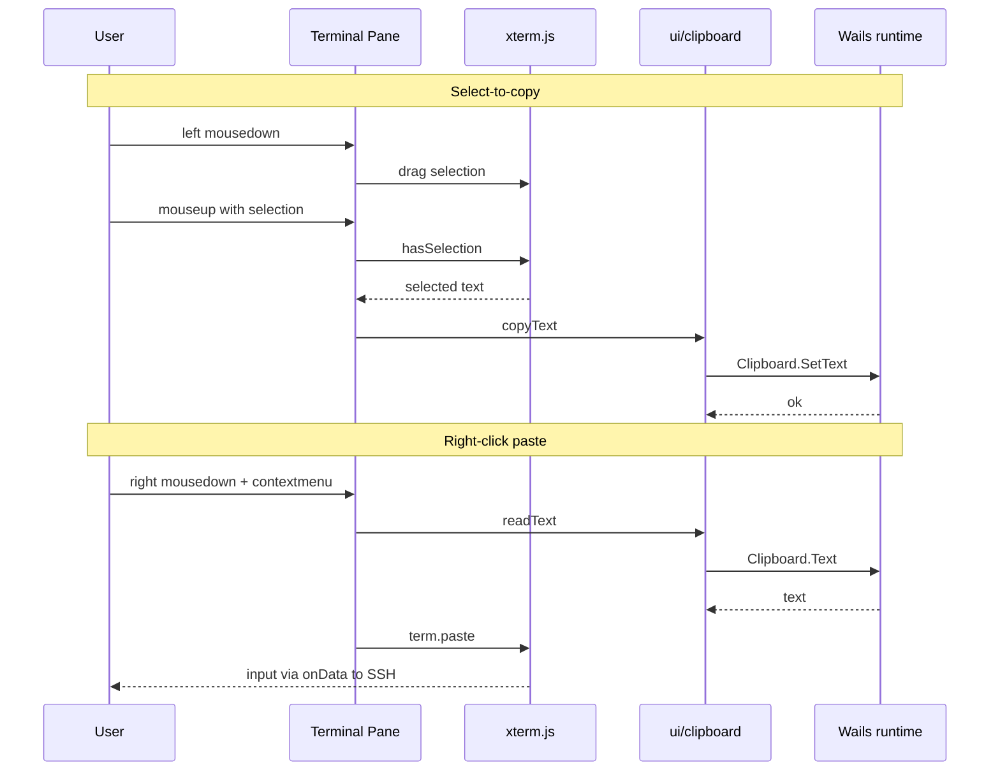

# Plan P003 — Terminal interaction polish: theme-aware cursor, select-to-copy, right-click paste

**Type:** Frontend-only refinement (post-v1.1). **Prereq:** none — touches Phase 4a (theme engine) and 4c (TermPool) code. **Scope:** 3 features, one plan.

**Master plan:** [`plans/1787912690309-master-plan.md`](plans/1787912690309-master-plan.md) — read **§2 (decisions A5, A6), §3 (xterm.js + addons stack), §5 (frontend package layout, event contract, backpressure), §6 (Terminal, Theming, Shortcuts, performance budgets), §8 (item 3 — no secret logging, memory hygiene), §9 (frontend testing), §12 (global acceptance)** before starting.

**Related code to read first (prior plans P001/4a/4c):**
- [`frontend/src/terminal/xterm.ts`](../frontend/src/terminal/xterm.ts) — TermPool: per-tab xterm instances, palette binding, input flush.
- [`frontend/src/ui/theme.ts`](../frontend/src/ui/theme.ts) — theme engine + `currentThemeTokens()` (plan P001).
- [`frontend/src/style/themes.css`](../frontend/src/style/themes.css) — variant token sets (`--terminal-bg`, `--terminal-fg`).
- [`frontend/src/components/terminal-view.ts`](../frontend/src/components/terminal-view.ts) — pane lifecycle, overlay gating.
- [`frontend/src/main.ts`](../frontend/src/main.ts) — `onThemeApplied(() => TermPool.applyTheme())` hook.

## Goal

Make the terminal usable with the mouse in every theme:
1. Text cursor is **always visible**: dark cursor in light themes, light cursor in dark themes (currently the cursor renders white in all themes because xterm.js defaults `theme.cursor` to `#ffffff` when unset — verified in xterm.js `src/browser/services/ThemeService.ts`: `DEFAULT_CURSOR = css.toColor('#ffffff')`; [`frontend/src/terminal/xterm.ts:92`](../frontend/src/terminal/xterm.ts:92) sets only `background`/`foreground`).
2. **Select-to-copy**: dragging a selection with the left mouse button copies the selected text to the system clipboard when the selection gesture completes.
3. **Right-click paste**: a right click pastes the current clipboard text into the active terminal (routed through the normal input path, with bracketed-paste support).

No Go/Wails-service changes. No settings-schema change (master §4). No new event-contract entries (master §5).

## Background facts driving the design

- xterm.js selection (drag, double-click word, triple-click line) is built in; `term.getSelection()` returns the highlighted text and `term.hasSelection()` reports presence.
- xterm's default selection color is white at 30% alpha — invisible on light backgrounds; the palette must also provide `selectionBackground`.
- `term.paste(text)` feeds xterm's own `onData` handler, so it reuses the existing rAF-buffered `TerminalService.Write` path and xterm applies bracketed-paste wrapping (`ESC[200~ … ESC[201~`) when the remote app enables it (readline/bash/vim safe multi-line paste).
- The Wails v3 JS runtime exports a system-clipboard module (`Clipboard.SetText(text)`, `Clipboard.Text()` — verified in `@wailsio/runtime` source `src/clipboard.ts`). It bypasses WebKitGTK secure-context/permission restrictions on `navigator.clipboard`. Small text over IPC is allowed (master §2 A5 limits large file bytes only).
- Terminal panes with state overlays (`connecting`/`error`/`closed`) cover the pane and capture pointer events, so mouse handlers only meaningfully fire in the `ready` state; an explicit gate keeps it airtight.
- xterm mouse-tracking mode (TUI apps such as vim/htop) receives raw `mousedown` events; right-click must be intercepted in the **capture phase** so it is never forwarded to the remote app as a mouse-mode button-2 event.

## Task list

### T1 — Theme-aware terminal palette (cursor + selection)

1. Extend [`currentThemeTokens()`](../frontend/src/ui/theme.ts:115) to return a full palette:
   - `cursor` = `--terminal-fg` (dark in light family, light in dark family),
   - `cursorAccent` = `--terminal-bg`,
   - `selectionBackground` = `--accent` converted to `rgba(r,g,b,0.3)` via a small hex→rgba helper (do **not** rely on `color-mix` — its computed serialization may not parse in xterm's color parser); neutral `rgba(128,128,128,0.3)` fallback.
   - Keep the existing per-family fallbacks for `background`/`foreground`.
2. In [`TermPool.create()`](../frontend/src/terminal/xterm.ts:81) and [`TermPool.applyTheme()`](../frontend/src/terminal/xterm.ts:246): set the full theme object `{ background, foreground, cursor, cursorAccent, selectionBackground }` so both initial creation and live re-paint (mode/variant/OS change via the `main.ts` hook) stay in sync.
3. Note for future variants: if a palette ever needs a cursor distinct from the foreground, introduce `--terminal-cursor` / `--terminal-cursor-accent` tokens in [`themes.css`](../frontend/src/style/themes.css) then — not needed for the current 12 variants.

### T2 — Clipboard helper [`frontend/src/ui/clipboard.ts`](../frontend/src/ui/clipboard.ts)

- `copyText(text: string): Promise<boolean>` — primary: `Clipboard.SetText(text)` from `@wailsio/runtime`; fallback: `navigator.clipboard.writeText`; last resort: hidden-textarea + `document.execCommand("copy")`.
- `readText(): Promise<string>` — primary `Clipboard.Text()`; fallback `navigator.clipboard.readText`.
- **Security (master §8.3):** never `console.log` clipboard payloads; failures surface only as generic messages; pasted/copied data is transient in memory and never persisted or sent anywhere except the SSH channel / OS clipboard.

### T3 — Select-to-copy (left mouse button)

Wire in [`TermPool.create()`](../frontend/src/terminal/xterm.ts:81) so each pooled terminal owns its listeners and `destroy(tabID)` tears them down (no leaks; master §6 leak-free teardown).

1. Add the xterm parent element to the `Entry` record and a `selecting` flag.
2. Capture-phase `mousedown` on the pane: `e.button === 0` → set `selecting = true`.
3. Capture-phase `mouseup` on `document`: if `selecting && term.hasSelection()` and the entry's pane is currently visible (`entry.el.offsetParent !== null` — hidden tabs must not clobber the clipboard with stale selections), copy: `copyText(term.getSelection())`; always clear `selecting`.
4. Do **not** clear the selection after copying — the highlight stays until the user clicks elsewhere or types (xterm default).
5. Covers drag-select and double/triple-click word/line selection automatically (all end in a mouseup).

**Copy-trigger semantics — owner decision (see Open question):**
- Behavior A (default): copy fires when the selection gesture completes (mouse release). Recommended; matches common terminal UX.
- Behavior B: additionally, a separate plain left click while a selection is already active copies it before xterm clears it.

### T4 — Right-click paste

Wire in [`TermPool.create()`](../frontend/src/terminal/xterm.ts:81); teardown in `destroy(tabID)`.

1. Capture-phase `mousedown` on the pane: `e.button === 2` → `preventDefault()` + `stopPropagation()` so xterm never forwards button 2 to mouse-tracking TUIs.
2. `contextmenu` listener on the pane: `preventDefault()`; if the tab is `ready` → `const text = await readText()`; `if (text) term.paste(text)`.
3. `term.paste()` feeds the existing `onData` → rAF flush → `TerminalService.Write` path (bracketed paste handled by xterm; no IPC changes).
4. Keep `rightClickSelectsWord` off; middle-click (button 1) behavior untouched (tab strip `auxclick` close and SFTP context menus are outside the pane and unaffected).

### T5 — Housekeeping, verification, docs

- Confirm [`TermPool.applyTheme()`](../frontend/src/terminal/xterm.ts:246) repaints the extended palette live.
- Confirm `destroy()`/`destroyAll()` remove every listener added in T3/T4; 50 lock/unlock + 50 tab open/close cycles stay leak-free with no console errors.
- No changes to `internal/` Go code, `internal/wailsvc/dto.go`, or the event contract; `make test` must stay green untouched.
- Optionally document the mouse behavior in the master plan §6 Terminal/Shortcuts paragraph and README (shortcuts/section) after sign-off — English only.

## Flow overview

## Verification

- `make lint` clean; `make test` still green (backend untouched — sanity run).
- Manual QA via `make build` + `make run` against a real sshd (host X11 run per master §7):
  1. **Cursor:** clearly visible in every light variant (dark cursor) and every dark variant (light cursor); switch System/Light/Dark and variant mid-session → live repaint via `applyTheme()`.
  2. **Select-to-copy:** drag-select → release → clipboard holds exactly the selection (verify in an external editor); double-click word and triple-click line also copy; highlight persists after copy.
  3. **Hidden-tab guard:** select in tab 1, switch to tab 2, select nothing, confirm clipboard unchanged.
  4. **Right-click paste:** single-line paste behaves as typed; multi-line paste into bash does NOT auto-execute (bracketed paste active); paste into `cat` shows raw text; empty clipboard is a no-op; paste does not appear in vim/htop as a mouse event.
  5. **TUI regression:** vim/htop left-click, wheel scroll and mouse-mode navigation still work; right-click pastes instead of acting as button 3.
  6. **Teardown:** lock/unlock ×50, 50 tab open/close cycles — no console errors, heap stable, listeners cleaned (DevTools check).
  7. **Overlay gate:** right-click during `connecting`/`error`/`closed` does nothing (no paste into a dead session).

## Exit criteria

Cursor and selection highlight are visible in all 12 theme variants with correct polarity per family; select-to-copy and right-click paste work per the agreed trigger semantics; bracketed paste honored; no regressions in mouse-mode TUIs, overlays, or teardown; `make lint` + `make test` green; zero Go/Wails-service changes.

## Non-goals (v1 scope guard)

- Middle-click paste, Ctrl+Shift+C/V shortcuts, configurable mouse-behavior settings, copy notifications/toasts, PRIMARY-selection integration — out of scope unless requested.

## Open question (owner decision, needed before implementation)

Copy trigger: **A** — copy when the selection gesture completes (mouse release after drag / double / triple click), or **B** — additionally copy on a separate plain left click while a selection is active? Default is A.