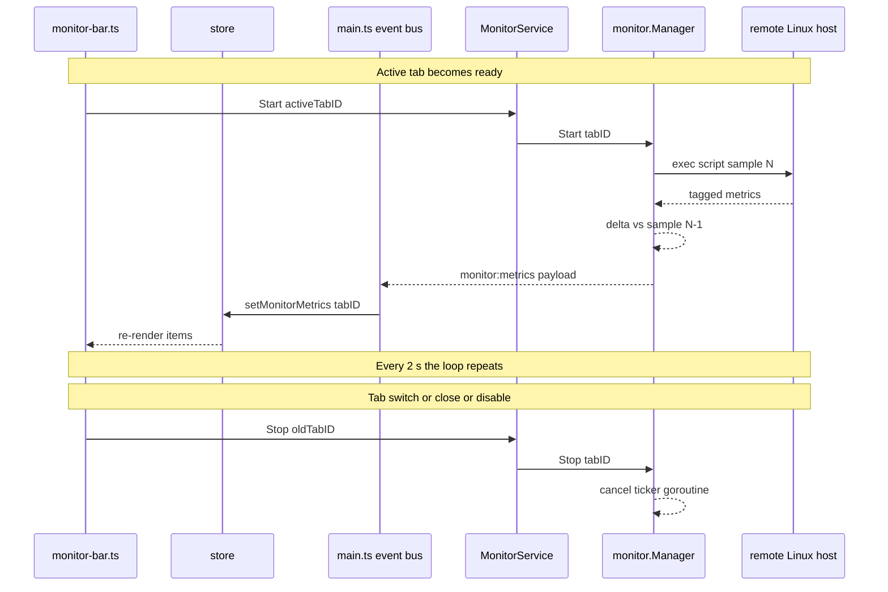
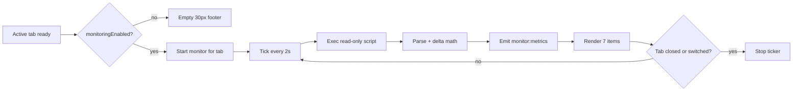

# Plan P004 — Remote system-monitoring panel (MobaXterm-style bottom bar)

**Type:** Backend + frontend feature (post-v1.1). **Prereq:** none — builds on Phase 4c (status bar), 4d (settings), 3c/5a wiring patterns. **Scope:** replace the bottom status bar with a live per-active-tab system monitor; new settings flag; new Go package + Wails service; unit + integration tests.

**Master plan:** [`plans/1787912690309-master-plan.md`](plans/1787912690309-master-plan.md) — read **§2 (decisions A3, A5, A6), §4 (settings.json schema, presence-aware defaults), §5 (package layout, Wails services, event contract, threading/failure modes, engine must NOT import wailsvc), §6 (Layout: status-band row; performance budgets; leak-free teardown), §7 (build targets), §8 (items 3, 9 — memory hygiene / no new network calls), §9 (unit + integration testing strategy), §12 (global acceptance)** before starting. The prior context phase plan is [`plans/1788003650840-phase-5c-sftp-panel.md`](plans/1788003650840-phase-5c-sftp-panel.md); the SFTP per-tab manager pattern it introduced ([`internal/sftp/manager.go`](../internal/sftp/manager.go)) is the template for the new monitor package.

**Related code to read first:**
- [`frontend/src/components/statusbar.ts`](../frontend/src/components/statusbar.ts) — the component being deleted (user@host + forward summary).
- [`frontend/src/components/shell.ts`](../frontend/src/components/shell.ts:207) — status-band mount point.
- [`frontend/src/style/base.css`](../frontend/src/style/base.css:101) — `.status-band` (22 px row in the grid).
- [`internal/config/settings.go`](../internal/config/settings.go:33) — settings schema + presence-aware default pattern (`sftpBrowserEnabled`, lines 89–98).
- [`frontend/src/store.ts`](../frontend/src/store.ts:163) — StoreState, Settings, per-tab caches (`forwards`, `sftpTransfers`) and their cleanup in `closeTab`.
- [`frontend/src/main.ts`](../frontend/src/main.ts:33) — event names + `handleEvent` + lock-reset payload.
- [`internal/app/app.go`](../internal/app/app.go:54) — composition root; note `engine.OnTabClosed(sftpMgr.HandleTabClosed)` at line 79 (single-hook constraint → must be composed).
- [`internal/wailsvc/dto.go`](../internal/wailsvc/dto.go) and [`internal/wailsvc/terminalservice.go`](../internal/wailsvc/terminalservice.go) — DTO + service patterns; vault gating.
- [`main.go`](../main.go:36) — Wails service registration list.
- [`frontend/src/components/settings-dialog.ts`](../frontend/src/components/settings-dialog.ts:167) — checkbox pattern (SFTP browser).

## Goal

A MobaXterm-style monitoring bar on the bottom panel, under the SSH terminal, rendered **left to right**:

1. **Hostname** of the remote machine.
2. **CPU load** — value in percent with a small inline gauge.
3. **RAM** — current usage / total, units chosen dynamically from MB / GB / TB.
4. **Network upload speed** — summed across all non-loopback interfaces (bytes/s).
5. **Network download speed** — summed across all non-loopback interfaces (bytes/s).
6. **Uptime** — formatted `Xd Yh Zm`.
7. **Disk (df)** — usage percent of the main partition (`/`) by default; hovering shows the full `df -h` output in a tooltip.

Requirement 0: the current bottom-bar text `user@host:port` and the port-forward summary are **removed entirely** (owner decision). Monitoring is **enabled by default** and can be disabled with a checkbox in the app's global settings (General group).

## Design decisions

| # | Decision | Choice |
|---|----------|--------|
| D1 | Collection mechanism | One SSH **exec channel per tick** over the existing final-hop connection (master §2 A5: reuse the active session's connection). One compact POSIX-shell script returns tagged lines; CPU% and net speeds are computed from **deltas between consecutive samples**. Linux-only targets (non-Linux hosts show an empty/frozen bar — accepted). |
| D2 | Which tab is monitored | Only the **active tab** (one bar per window). The frontend drives lifecycle: `MonitorService.Start(tabID)` when the active tab is ready, `Stop(tabID)` on switch/close/lock. The backend stays stateless about "active". |
| D3 | Ticker lifecycle | `internal/monitor.Manager` keeps a per-tab cancelable goroutine keyed by tabID. `Start` is idempotent (restarts, resets baselines); `Stop`/`HandleTabClosed` cancel. The engine's single `OnTabClosed` hook is **composed** in [`internal/app/app.go`](../internal/app/app.go:79) to call both the SFTP closer and the monitor closer. |
| D4 | Poll interval / timeouts | Fixed 2 s tick (const), 5 s per-exec timeout (const). Delta math uses measured elapsed time (`time.Since`), not the nominal interval. No new settings entries besides the on/off flag. |
| D5 | Failures | A failed exec emits nothing for that tick and the ticker **keeps trying** (transient errors tolerated). Tab teardown (state closed/error via `HandleTabClosed`) stops the ticker. No error toasts from the monitor loop (avoid noise); the bar just freezes/stales and the store marks `updatedAt` so the UI can dim stale data. |
| D6 | df tooltip data | The full `df -h` output is included in every tick payload (a few hundred bytes; negligible next to terminal I/O — master §2 A6 budget). The tooltip is therefore always fresh and there is no on-hover round trip. |
| D7 | Network totals | Sum `rx_bytes`/`tx_bytes` (columns 2/10 of `/proc/net/dev`) across all interfaces **except loopback** (`lo:`). Physical + virtual interfaces are summed. |
| D8 | Main partition | `df -kP /` (POSIX single-line format guarantees one row); mount point `/` is the "main partition". |
| D9 | Security | The script is a **static constant** (no user input → no injection surface) and runs read-only commands (`cat`/`awk`/`df`). It executes as the SSH user — same privilege level as the terminal itself. No new network endpoints (master §8.9 preserved). Metrics payload crosses IPC as small JSON only (master §2 A5 allows small events). |

## Remote collection contract

One exec per tick runs this script (constant in Go; `export LC_ALL=C` keeps `df` output stable):

```sh
export LC_ALL=C
printf 'HN=%s\n' "$(cat /proc/sys/kernel/hostname 2>/dev/null)"
awk '/^cpu /{printf "CP=%s %s %s %s %s %s %s\n", $2,$3,$4,$5,$6,$7,$8}' /proc/stat
awk '/^MemTotal:/{t=$2} /^MemAvailable:/{a=$2} /^MemFree:/{f=$2} /^Buffers:/{b=$2} /^Cached:/{c=$2} END{if(!a)a=f+b+c; printf "MEM=%d %d\n", t, a}' /proc/meminfo
awk 'NR>2 && $1 !~ /^lo:/ {rx+=$2; tx+=$10} END{printf "NET=%d %d\n", rx, tx}' /proc/net/dev
awk '{print "UP=" int($1)}' /proc/uptime
df -kP / | awk 'NR==2 {printf "DFROOT=%s %s %s %s %s\n", $2,$3,$4,$5,$6}'
printf 'DFH_START\n'
df -h
printf 'DFH_END\n'
```

Parsing rules (pure functions, unit-tested):
- `HN` → hostname. `CP` → 8 tick counters (user nice system idle iowait irq softirq steal). CPU% = `100 * busyΔ / totalΔ` where busyΔ = user+nice+system+iowait+irq+softirq+steal deltas and totalΔ = busyΔ + idleΔ. First sample after Start/restart establishes the baseline; the tick that produced the baseline emits `cpuPercent: 0`.
- `MEM` → `totalKiB availableKiB` → bytes. Used = total − available (MemAvailable preferred; `MemFree+Buffers+Cached` fallback in the awk).
- `NET` → cumulative `rx tx` bytes → up = `txΔ/elapsed`, down = `rxΔ/elapsed` (first sample → 0).
- `UP` → uptime seconds. Formatter: `3d 4h 12m`, below one hour `34m`, below one minute `45s`.
- `DFROOT` → `sizeKiB usedKiB availKiB usePct mount` (usePct like `42%`). `DFH_START … DFH_END` block → `dfText` verbatim (full human-readable listing for the tooltip).
- RAM/bytes humanizer (binary 1024 base, labels per requirement): `< 1024 MiB → "512.3 MB"`, `< 1024 GiB → "7.9 GB"`, else `"1.2 TB"`; RAM line renders `used / total`, e.g. `3.1 GB / 15.6 GB`.

## Task list

### T1 — Settings flag `monitoringEnabled` (default ON)

1. [`internal/config/settings.go`](../internal/config/settings.go:33): add `MonitoringEnabled bool json:"monitoringEnabled"` to `Settings`; set `true` in `DefaultSettings()`; mirror the presence-aware `sftpBrowserEnabled` handling in `Load()` (lines 89–98): if the key is absent from `settings.json`, force `true`; an explicit `false` wins. `normalize()` needs no change (bool).
2. [`internal/config/config_test.go`](../internal/config/config_test.go): assert default true on a missing file; explicit `false` round-trips; explicit `true` round-trips; no-secret guard unaffected.
3. Frontend mirrors:
   - [`frontend/src/store.ts`](../frontend/src/store.ts:39): add `monitoringEnabled: boolean` to `Settings` and `initialState` (default `true`, comment mirrors the SFTP-default note at lines 211–213).
   - [`frontend/src/main.ts`](../frontend/src/main.ts:48): map `monitoringEnabled: Boolean(raw.monitoringEnabled ?? true)` in `toSettings` (presence-aware: backend already forces `true` when absent, so the `?? true` is belt-and-braces).
   - [`frontend/src/components/settings-dialog.ts`](../frontend/src/components/settings-dialog.ts:167): in the General group add a checkbox "System monitoring" (pattern copied from the SFTP checkbox) with hint `Shows hostname, CPU, RAM, network, uptime and disk usage under the terminal.`; include `monitoringEnabled: monCheck.checked` in the Save payload (line ~298).

### T2 — New Go package `internal/monitor`

Model on [`internal/sftp/manager.go`](../internal/sftp/manager.go) (same layering rules: no wails imports, structural interfaces, mutex-guarded state, typed errors).

- `manager.go`:
  - `type TabProvider interface { SSHClient(tabID string) (*ssh.Client, error) }` (structurally satisfied by `sshengine.Manager`; monitor never imports the engine).
  - `type Emitter interface { Emit(event string, payload any) }` (structurally satisfied by `wailsvc.LateEmitter`).
  - `type Manager struct` with `mu sync.Mutex`, `prov TabProvider`, `emit Emitter`, `runs map[string]context.CancelFunc`, `prev map[string]*rawSample`, and injectable knobs `Interval` (2 s), `ExecTimeout` (5 s), plus an injectable `execFn` used only by tests (default = real `ssh.Session.CombinedOutput` runner). Injecting `execFn` keeps the manager unit-testable without an SSH server.
  - `New(emit Emitter) *Manager`; `Attach(p TabProvider)` (idempotent, replaces).
  - `Start(tabID string) error`: validates via provider `SSHClient` (propagates engine `ErrUnknownTab`/`ErrTabNotReady`), cancels any existing run for the tab, clears the baseline, spawns the tick goroutine.
  - `Stop(tabID string)`: cancels the run goroutine, drops state (idempotent, safe for unknown tab).
  - `HandleTabClosed(tabID string)`: alias of `Stop` (idempotent) — registered via the composed engine hook.
  - `CloseAll()`: cancels every run (app shutdown belt-and-braces; per-tab teardown normally goes through `HandleTabClosed`).
  - Tick loop: immediate first sample (baseline) → every `Interval`: run script (exec timeout via context), parse, compute deltas vs `prev`, update `prev`, emit `monitor:metrics`. Emit while holding NO lock (copy emitter ref). Consecutive-failure counter: after 5 consecutive failures silently stop the ticker (defensive; the tab is likely dead and the frontend will restart on next ready state).
- `script.go` (or `collect.go`): the script constant from the contract above; `runScript(ctx, client, timeout) ([]byte, error)` using `client.NewSession()` + `CombinedOutput` (close session in defer; never leaks channels).
- `parse.go`: `parseSample(out []byte) (*rawSample, error)` — pure parser for the tagged lines; `rawSample{Hostname string; CP [8]uint64; MemTotal, MemAvail uint64; NetRx, NetTx uint64; Uptime uint64; DiskUsedPct float64; DiskRoot string; DfText string}`.
- `format.go`: pure helpers — `humanizeBytes(bytes uint64) string` (MB/GB/TB per D-rule), `formatUptime(seconds uint64) string`, `cpuPercent(prev, cur *rawSample) float64`, `netSpeeds(prev, cur, elapsed) (up, down uint64)`.
- Payload + event name in this package (mirrors `sshengine` payloads, e.g. [`internal/sshengine/manager.go:64`](../internal/sshengine/manager.go:64)):

```go
const EventMonitorMetrics = "monitor:metrics"

type MetricsPayload struct {
    TabID         string  `json:"tabID"`
    Hostname      string  `json:"hostname"`
    CPUPercent    float64 `json:"cpuPercent"`
    MemUsedBytes  uint64  `json:"memUsedBytes"`
    MemTotalBytes uint64  `json:"memTotalBytes"`
    NetUpBps      uint64  `json:"netUpBps"`
    NetDownBps    uint64  `json:"netDownBps"`
    UptimeSeconds uint64  `json:"uptimeSeconds"`
    DiskUsedPct   float64 `json:"diskUsedPct"`
    DiskRoot      string  `json:"diskRoot"`
    DfText        string  `json:"dfText"`
}
```

### T3 — `MonitorService` in wailsvc + wiring

1. [`internal/wailsvc/monitorservice.go`](../internal/wailsvc/): `MonitorService{ vault *vault.Vault; mon *monitor.Manager }`; `NewMonitorService(v, mon)`; methods `Start(tabID string) error` and `Stop(tabID string) error`, both gated by `vault.IsUnlocked()` → `vault.ErrLocked` (mirror [`internal/wailsvc/terminalservice.go:30`](../internal/wailsvc/terminalservice.go:30)). `Start` delegates to `mon.Start` (propagates engine errors so the UI can ignore); `Stop` delegates to `mon.Stop` (returns nil always — idempotent).
2. [`internal/app/app.go`](../internal/app/app.go:31): add `monMgr *monitor.Manager` and `monitorService *wailsvc.MonitorService` fields. In `New()`: `monMgr := monitor.New(emit); monMgr.Attach(engine)`; **replace** `engine.OnTabClosed(sftpMgr.HandleTabClosed)` (line 79) with `engine.OnTabClosed(func(id string){ sftpMgr.HandleTabClosed(id); monMgr.HandleTabClosed(id) })`; construct the service; add getter `MonitorService()`. In `Shutdown()` (line 141): `a.monMgr.CloseAll()` alongside `sftpMgr.CloseAll()`.
3. [`main.go`](../main.go:36): register `application.NewService(a.MonitorService())` in the Services list.
4. **Regenerate bindings** (`make build` or the wails generate step inside the container) so `frontend/bindings/shelve/internal/wailsvc` exposes `MonitorService` — required before `tsc`/`make lint` passes.

### T4 — Event bus: `monitor:metrics`

1. [`frontend/src/main.ts`](../frontend/src/main.ts:33): add `MonitorMetrics: "monitor:metrics"` to `EV`; handle in `handleEvent`: parse payload (`tabID`, plus the numeric/string fields; `cpuPercent`/`diskUsedPct` as `Number`) → `store.setMonitorMetrics(tabID, {...})` with `updatedAt: Date.now()`. Subscribe in `subscribeEvents()` (line 226).
2. Lock reset (line 129): add `monitor: {}` to the store reset payload (same place `forwards`/`sftpTransfers` are cleared).

### T5 — Frontend store

[`frontend/src/store.ts`](../frontend/src/store.ts):
- Add `interface MonitorMetrics { hostname: string; cpuPercent: number; memUsedBytes: number; memTotalBytes: number; netUpBps: number; netDownBps: number; uptimeSeconds: number; diskUsedPct: number; diskRoot: string; dfText: string; updatedAt: number }`.
- Add `monitor: Record<string, MonitorMetrics>` to `StoreState` and `initialState: {}` (comment: per-tab latest metrics cache, never persisted — mirrors `forwards`).
- `setMonitorMetrics(tabID, m)` action (upsert, new object identity for subscribers).
- Cleanup in `closeTab` (line 361): delete `monitor[tabID]` alongside `forwards`/`sftpTransfers`.

### T6 — Frontend monitor bar (replaces statusbar)

1. New [`frontend/src/components/monitor-bar.ts`](../frontend/src/components/): `renderMonitorBar(el: HTMLElement)` mounted into `footer.status-band`.
   - Subscription logic (single source of truth): visible = `settings.monitoringEnabled && activeTab && activeTab.state === "ready"`. Track the currently monitored tab in a closure variable; when the monitored tab ID changes or visibility flips → `MonitorService.Stop(prevID)` (when set) and `MonitorService.Start(newID)` (when becoming visible). Guard against re-entrancy: metric events update the store → re-render must NOT trigger Start/Stop churn (only the tabID/visibility transition does).
   - Items left→right (each `.mon-item`): Hostname (plain text) · CPU (label `CPU`, thin inline gauge + `NN%`) · RAM (gauge + `used / total` humanized via a local copy of the MB/GB/TB formatter) · Up (`↑ 1.2 MB/s`, format `KB/s`/`MB/s`/`GB/s`) · Down (`↓ …`) · Uptime (`3d 4h 12m`) · Disk (label `Disk NN%` from `diskUsedPct`, wrapped in `.mon-disk` whose hover shows the `dfText` in a custom tooltip — see T7; native `title` cannot render multi-line preformatted text).
   - Stale rendering: if `updatedAt` is older than 10 s (or no metrics yet), render dimmed `—` placeholders instead of numbers (monitor still starting / remote unresponsive).
   - When not visible (disabled or no ready tab): render nothing into the footer (keep the 30 px row so the grid stays stable).
   - All formatting helpers (`humanizeBytes`, `formatUptime`, speed format) are small pure functions inside this file; the backend sends raw numbers only (no formatting decisions in Go beyond what the payload already carries).
2. [`frontend/src/components/statusbar.ts`](../frontend/src/components/statusbar.ts): **delete** (user@host + forwards removed per owner decision; no other consumer).
3. [`frontend/src/components/shell.ts`](../frontend/src/components/shell.ts:22): replace the `renderStatusBar` import/call (line 211) with `renderMonitorBar`. Update the comment at line 207 ("Status bar …") to describe the monitor bar.
4. CSS:
   - [`frontend/src/style/base.css`](../frontend/src/style/base.css:20): grid rows `1fr 22px` → `1fr 30px`; `.status-band` (line 101) height accordingly (padding/gap tuning) so the gauges fit.
   - [`frontend/src/style/components.css`](../frontend/src/style/components.css): add `.mon-item` (+ `.mon-label`, `.mon-value`), `.mon-gauge` (2 px track + fill colored by threshold: normal `--ok`/`--accent`, >80 % `--warn`, >95 % `--error`), `.mon-disk` with `.mon-tooltip` (absolute, above the item, `white-space: pre`, monospace, `--bg-panel` background, `--border`, z-index above terminal, max-width with horizontal scroll). Tooltip hidden by default, shown on `:hover`/`:focus-within`. Remove `.status-band .fwd` rules (lines 115–123) as unused.

### T7 — Tests

1. Unit [`internal/monitor/monitor_test.go`](../internal/monitor/) (no SSH server needed):
   - `parseSample` on canned script output (valid, missing optional lines, `DFH_START/END` block, MemAvailable-absent fallback is a Go-side concern? — no, the fallback lives in the awk; test the parsed values it produces).
   - `cpuPercent` math with hand-computed samples (including 0 % and 100 % edges); `netSpeeds` with fixed elapsed; `humanizeBytes` boundaries (1023 MiB → MB, 1024 MiB → GB, 1024 GiB → TB); `formatUptime` cases (45 s, 34 m, 3 d 4 h 12 m).
   - Manager behavior with a fake `TabProvider` + injected `execFn` returning canned outputs: `Start` emits `monitor:metrics` after 2 ticks with correct deltas; `Stop` cancels (no further emits); `HandleTabClosed` idempotent; `Start` on an unknown tab propagates the provider error; consecutive-failure stop after 5 bad execs. Use a short `Interval` (e.g. 50 ms) for speed; run with `-race` (`make test` already does).
2. Config tests (T1) + a settings round-trip asserting `monitoringEnabled` presence-awareness.
3. Integration [`internal/monitor/integration_test.go`](../internal/monitor/) (build tag `integration`; reuse the 3e `startSshd` helper and the connection setup pattern from [`internal/sftp/integration_test.go`](../internal/sftp/integration_test.go)): connect to the docker/sshd container via the engine, `MonitorService.Start(tabID)` (or `mon.Start`), collect emitted payloads for ~2 intervals → assert `hostname` equals the container hostname (`uname -n` check), `cpuPercent` in [0,100], `memTotalBytes > 0`, `netUp/DownBps >= 0`, `uptimeSeconds > 0`, `diskUsedPct > 0` and `dfText` contains `/`. Then `Stop` and assert no further events.
4. Frontend: `tsc --noEmit` (via `make lint`) with the regenerated bindings.

### T8 — Docs + manual QA checklist

1. [`README.md`](../README.md) (Development section): document the monitoring bar — enabled by default, checkbox in Settings → General; data comes from read-only commands executed on the remote host over the active SSH connection (Linux targets; non-Linux shows no data); 2 s refresh; net speeds are the sum of all non-loopback interfaces; `df` hover shows full `df -h`.
2. Manual QA (host-run binary per master §7: `make build` + `make run`, real Linux VM/container target):
   - Fresh config dir → unlock → connect → the bar appears with hostname, CPU % (moves under load, e.g. `yes >/dev/null &` on the remote), RAM used/total in MB/GB, up/down speeds (watch them change during a remote `dd | nc`-style transfer), uptime matching `uptime`, disk % matching `df -h /`.
   - Hover over Disk → full `df -h` listing tooltip (multi-line, monospace); tooltip dismisses on mouse-out.
   - Switch tabs (two connections) → bar switches to the active tab's host within ≤ 2 s; no Start/Stop churn in DevTools network/console.
   - Settings: uncheck System monitoring → bar clears and remote exec traffic stops (verify no `monitor:metrics` events); re-check → bar resumes; setting persists across restart.
   - Close the tab / lock the vault → ticker stops (no leaked goroutines; `-race` clean in tests; DevTools shows no listener growth after 50 open/close cycles).
   - Non-Linux target (if available) or a host with `df` restricted: bar shows dimmed `—`, no crash, no toast spam.
   - Regression: SFTP panel, terminal, tree, session editor unaffected; status band height change does not clip the terminal.

## Flow overview





## Verification

- `make test` (unit + `-race`), `make lint` (gofmt, vet, `tsc --noEmit` with regenerated bindings), `make test-integration` (monitor integration test included) — all green from a clean container.
- Manual QA checklist (T8) executed and annotated in the commit message.
- Code-review assertions: `rg` sweep shows no plaintext secrets in the new payload/script paths; no new network dials anywhere in `internal/monitor` (master §8.9); monitor never imports wails or the engine (only structural interfaces); statusbar removed with no dangling imports.

## Exit criteria

- Bottom bar shows the seven items left-to-right for the active ready tab, live at 2 s cadence, with the df hover tooltip; `user@host` and forward summary gone.
- `monitoringEnabled` defaults to ON, is toggleable in Settings, presence-aware on load, and honored at runtime (bar + backend ticker stop when off).
- Ticker lifecycle is fully tied to tab state: no leaks on tab close, switch, lock, or app exit (`-race` clean).
- All four make gates pass from a clean container; README documents the feature and its Linux-only, read-only-command model.

---

## Addendum 2026-09-01 — dedicated monitoring connection (post-implementation fix)

**Deviation from D1:** the exec is no longer run over the tab's existing
final-hop connection. User-visible bug: with an active `tail -f`, terminal
output stuttered every 2 s — the monitor exec on the shared connection
paused PTY data delivery for up to seconds (verified via pump read-gap
instrumentation). Fix: the monitor opens a **dedicated SSH connection** to
the final hop per Start (`sshengine.Manager.DialMonitorClient`, reusing the
same dial chain + auth/passphrase caches and a separate `tabID+"-monitor"`
connID), so metric execs never contend with the PTY channel.

Consequences:
- `monitor.Manager` now talks to the engine through the structural `Dialer`
  interface (`DialMonitorClient(tabID) ([]*ssh.Client, error)`, all hop
  clients owned and closed by the monitor on Stop/tab-close/shutdown)
  instead of `TabProvider.SSHClient`. `SSHClient` remains for SFTP.
- Start dials synchronously (auth errors surface immediately to the frontend
  toast); the dedicated conn is released on Stop/HandleTabClosed/CloseAll
  and on restart.
- The `tick` loop now checks `ctx.Done()` before counting a failure, so a
  Stop/restart releasing the connection mid-exec can never let a stale run
  kill a newer one via the self-stop path.
- Unit tests use a fake `Dialer`; the integration test passes a real client
  through a `liveDialer`. New engine test
  [`internal/sshengine/monitor_client_test.go`](../internal/sshengine/monitor_client_test.go)
  asserts the dedicated client is independently usable and coexists with the
  live PTY.
- Still no new network endpoints beyond the user's own SSH hosts
  (master §8.9); commands stay read-only and static.