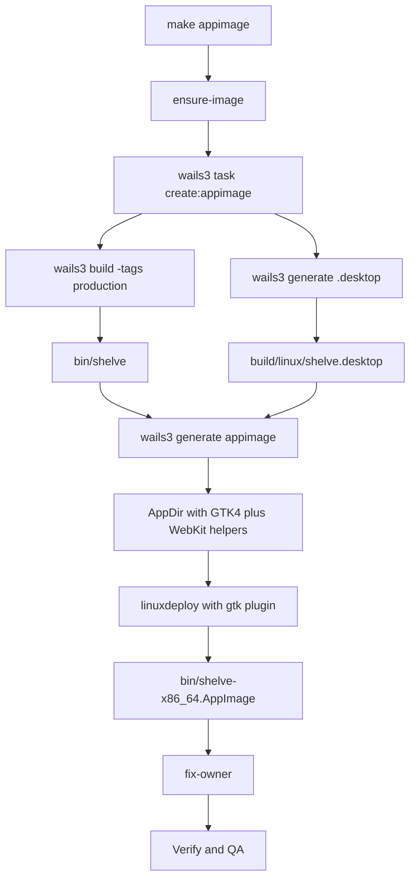

# Plan P004 — Linux AppImage packaging via `make appimage`

**Type:** Build-system + packaging (post-v1.1; revives the *ad-hoc* `make appimage`
target from master §7 — the cancelled Phase 6 scope stays cancelled: only the
AppImage variant is implemented, DEB/RPM remain stubs). **Prereq:** existing
Phase 1 Makefile + [`Dockerfile.dev`](../Dockerfile.dev). **Scope:** Makefile,
Dockerfile.dev, README, and optional verification scripts only — **zero** Go /
frontend product code.

**Master plan:** [`plans/1787912690309-master-plan.md`](plans/1787912690309-master-plan.md) —
read the following sections before starting:

| Section | Why it matters here |
|---|---|
| **§1 Goals & Non-Goals** | Delivery goal: cross-distro via `wails3 package` — AppImage primary; packaging is NOT part of v1 acceptance, this plan restores the ad-hoc path only. |
| **§2 D1** | Distribution decision: `make build` binary is the v1 delivery; AppImage stays an ad-hoc Makefile target — we do not resurrect the release pipeline. |
| **§3 Technology Stack** | Packaging row (`wails3 package GOOS=linux` → AppImage) and Build row (shelve-dev image contents, wails3 pinned beta). |
| **§7 Build & Development Environment** | Docker-only host rule, `Dockerfile.dev` apt list, `make package\|appimage` target table rows, notes on gitignored `bin/`, icon/desktop assets. |
| **§8 Security Requirements** | Items 4 (config dir 0700 / files 0600) and 9 (no network beyond user SSH + 127.0.0.1) are QA anchors for the packaged app; packaging adds no new secret surface. |
| **§11 Risks** | WebKitGTK 6.0 availability row — AppImage bundles the runtime so end users need zero deps; that is exactly what this plan operationalizes. |
| **§12 Global Acceptance** | #1 (runs on a stock desktop with zero installed deps) and #5 (`make build/test/lint` green from a clean container) are the acceptance anchors. |

**Note on the referenced plan:** the phase plan
[`plans/1788003650840-phase-5c-sftp-panel.md`](plans/1788003650840-phase-5c-sftp-panel.md)
(the project's FINAL GATE) is a roadmap phase plan, not the master plan; its own
"Master plan:" pointer names the document linked above. This AppImage plan is a
post-roadmap feature that must not regress any 5c exit criterion.

**Related code to read first:**
- [`Makefile`](../Makefile:151) — packaging stubs (`package`/`appimage`), [`fix-owner`](../Makefile:43).
- [`Dockerfile.dev`](../Dockerfile.dev:10) — apt list of the build toolchain.
- [`build/linux/Taskfile.yml`](../build/linux/Taskfile.yml:112) — `create:appimage`, `generate:dotdesktop`.
- [`build/linux/appimage/build.sh`](../build/linux/appimage/build.sh:1) — legacy wails template script; **not used** by the pinned CLI (superseded by Go logic, see Background #1); keep untouched so future `make wails-init` merges stay clean.
- [`build/linux/shelve.desktop`](../build/linux/shelve.desktop:1) — regenerated by `generate:dotdesktop` before packaging.
- Pinned upstream sources (for reference only, version `v3.0.0-beta.15`): `v3/internal/commands/appimage.go` and `v3/internal/commands/linuxdeploy-plugin-gtk.sh` in `github.com/wailsapp/wails`.

## Goal

`make appimage` produces a self-contained `bin/shelve-x86_64.AppImage` (arch
derived from `runtime.GOARCH`) entirely inside the existing `shelve-dev`
container — the host needs Docker only (master §7) — bundling the GTK4 +
WebKitGTK 6.0 runtime, the WebKit helper processes, GLib schemas, and GDK pixbuf
loaders so end users need zero installed dependencies (master §11, §12 #1).

## Background facts driving the design

1. **The pinned CLI does the whole job in Go.** In `wails3 v3.0.0-beta.15`
   (`appimage.go`), `wails3 generate appimage -binary -icon -desktopfile
   -outputdir -builddir`:
   - builds `<name>-<arch>.AppDir` under `-builddir`: binary → `usr/bin/`,
     icon → `.DirIcon` + symlink, desktop file at AppDir root;
   - downloads `linuxdeploy-<arch>.AppImage` and `AppRun-<arch>` from GitHub
     releases (cached in `-builddir` across runs — re-download only when missing);
   - runs `ldd` on the binary to detect the GTK major (`libgtk-4.so` → GTK4);
   - walks `/usr` for `WebKitWebProcess`, `WebKitNetworkProcess`,
     `libwebkitgtkinjectedbundle.so` and copies them into the AppDir (these are
     dlopened/exec'd by WebKitGTK and cannot be found by plain ldd);
   - writes the embedded `linuxdeploy-plugin-gtk.sh` next to linuxdeploy;
   - executes `linuxdeploy --appimage-extract-and-run --appdir <dir> --output
     appimage --plugin gtk` with `DEPLOY_GTK_VERSION=4` and
     `OUTPUT=<name>-<arch>.AppImage`;
   - sets `NO_STRIP=1` when `.relr.dyn` sections are detected (modern
     toolchains — Debian 13 trixie gcc-14 qualifies), avoiding the
     linuxdeploy-strip incompatibility;
   - moves the artifact to `-outputdir`.
2. **No FUSE needed inside the container:** `--appimage-extract-and-run`
   forces extraction mode, so the root container needs neither `/dev/fuse` nor
   fusermount for the linuxdeploy AppImage itself.
3. **GTK plugin prerequisites inside the build image** (`linuxdeploy-plugin-gtk.sh`):
   hard-required: `bash`, `find` (findutils), `pkg-config`/`pkgconf`,
   `dpkg-architecture` (from `dpkg-dev`, pulled in by `build-essential`),
   `glib-compile-schemas` (from `libglib2.0-dev-bin` — already installed).
   Tolerant fallbacks: `gdk-pixbuf-query-loaders`, `gtk-query-immodules-3.0`
   (missing → WARNING only). The one real risk: the `gobject-introspection-1.0`
   typelib dir fallback (`/usr/lib/<triplet>/girepository-1.0`) is copied
   unconditionally — if absent, `cp` aborts the plugin under `set -e`. T2 must
   probe this and, if needed, add `libgirepository-1.0-dev` (+ `gir1.2-gtk-4.0`
   for the typelibs) to [`Dockerfile.dev`](../Dockerfile.dev:10).
4. **Output naming:** `bin/shelve-x86_64.AppImage` (map: `amd64→x86_64`,
   `arm64→aarch64`). No version suffix in v1 (matches the `nfpm.yaml`/config
   `0.1.0` convention; a versioned alias is an optional stretch).
5. **Scratch dir:** `build/linux/appimage/build` (the `-builddir`) is already
   gitignored (`.codeassistantignore`) and holds downloaded linuxdeploy + the
   AppDir during generation — it must also join the `fix-owner` chown list so
   repeated root-container runs do not leave root-owned files behind.
6. **Runtime behavior of the produced AppImage:** on end-user machines FUSE2/3
   is normally present; where it is not, `--appimage-extract-and-run` works as
   a fallback. The GTK plugin writes an AppRun hook that pins
   `GDK_BACKEND=x11`, `GTK_THEME=Adwaita:<variant>`, `GTK_DATA_PREFIX`,
   `XDG_DATA_DIRS`, `GSETTINGS_SCHEMA_DIR`, `GI_TYPELIB_PATH`, `GTK_PATH` to
   AppDir paths — so the app must keep working with the x11 backend
   (`GDK_BACKEND=x11` is already the container dev convention, master §7 note).

## Task list

### T1 — Makefile wiring ([`Makefile`](../Makefile:151))

1. Replace the `appimage` stub with the container invocation:
   `$(DOCKER_RUN) $(IMAGE) task create:appimage` then `$(MAKE) fix-owner`.
   `wails3 task create:appimage` (defined in
   [`build/linux/Taskfile.yml`](../build/linux/Taskfile.yml:112)) encapsulates
   the correct sequence: release build (`-tags production`, CGO, in-container
   gcc → `build:native`), `generate:dotdesktop` → `build/linux/shelve.desktop`,
   `generate:icons`, then `wails3 generate appimage` with
   `-builddir build/linux/appimage/build` and `-outputdir bin`.
2. Extend [`fix-owner`](../Makefile:43) with `/app/build/linux/appimage/build`.
3. Make `package` depend on `appimage` (keep `deb`/`rpm` stubs; update their
   help text to state they remain unimplemented per the cancelled Phase 6 —
   do not silently wire them).
4. Update the `##` help comments so `make help` is accurate.

### T2 — Toolchain probe & Dockerfile.dev adjustments

1. Run `make appimage` once in the container and assert every GTK-plugin
   prerequisite resolves: `dpkg-architecture`, `pkg-config`, `find`,
   `glib-compile-schemas`, and the presence of
   `/usr/lib/<triplet>/girepository-1.0` (or the `gobject-introspection-1.0.pc`
   file).
2. If the plugin aborts on the typelib/girepository dir, add
   `libgirepository-1.0-dev` (and `gir1.2-gtk-4.0` if the typelibs themselves
   are missing) to the apt list in [`Dockerfile.dev`](../Dockerfile.dev:10),
   rebuild `shelve-dev`, and re-run.
3. Verify linuxdeploy caching: a second `make appimage` run must not re-download
   linuxdeploy (checks `EXISTS` in builddir).
4. No host toolchain is installed at any point (master §7 rule).

### T3 — Artifact verification (headless)

1. Extract the artifact: `bin/shelve-x86_64.AppImage --appimage-extract` and
   assert presence of: `usr/bin/shelve`, `usr/lib/libgtk-4*.so*`,
   `usr/lib/libwebkitgtk*.so*`, WebKit helpers
   (`usr/libexec/webkit2gtk-6.0/WebKitWebProcess`,
   `WebKitNetworkProcess`, `libwebkitgtkinjectedbundle.so`),
   `usr/share/glib-2.0/schemas/gschemas.compiled`, a pixbuf loaders cache,
   `usr/share/applications/shelve.desktop`, `AppRun`, `.DirIcon`.
2. Zero-dependency check (master §12 #1): inside a pristine `debian:13-slim`
   container (no GTK packages), run
   `LD_LIBRARY_PATH=<extracted>/usr/lib ldd <extracted>/usr/bin/shelve` and
   assert every non-glibc/non-kernel dependency resolves inside the AppDir, not
   to system paths. Optionally commit this as `scripts/verify-appimage.sh` and
   expose it as `make appimage-check` (docker-driven, same `DOCKER_RUN` pattern).
3. Desktop entry sanity: `Exec`/`Icon` names resolve inside the AppDir; the
   desktop file is installed at the AppImage-standard location.
4. Secrets sweep (master §8): `rg` the extracted payload for test credentials —
   none allowed outside `docker/sshd` fixtures (same rule as phase 5c QA).

### T4 — Host QA (real run, X11)

1. Run `bin/shelve-x86_64.AppImage` on the host (X11; fall back to
   `--appimage-extract-and-run` if FUSE is unavailable on ALT Linux): window
   opens < 2 s (master §12 #1), vault create/unlock, connect to the
   `docker/sshd` integration server, terminal works, SFTP panel browse/upload/
   download, lock.
2. Post-run assertions: `~/.config/shelve` stays 0700 / files 0600
   (master §8.4); no stray `tmp/` leftovers; no network activity beyond the
   test sshd (master §8.9).
3. Regression: `make lint`, `make test` (and `make test-integration` where
   available) stay green — the plan touches no product code, so these gates
   must pass unchanged.

### T5 — Documentation ([`README.md`](../README.md))

1. New "Packaging (AppImage)" section: `make appimage` →
   `bin/shelve-x86_64.AppImage`; run instructions incl. the FUSE note and
   `--appimage-extract-and-run` fallback; note that linuxdeploy/AppRun are
   downloaded at build time (network needed during packaging); state the
   bundling scope (GTK4 + WebKitGTK 6.0 included, config-perms unchanged).
2. Keep the master-plan note intact: DEB/RPM/Flatpak installer docs remain
   deferred with the cancelled Phase 6; only the AppImage variant is documented.

## Flow overview

## Verification

- From a clean container state (fresh `shelve-dev` rebuild): `make appimage`
  produces `bin/shelve-x86_64.AppImage`; T3 headless checks pass.
- Host-run QA (T4) executed and annotated, incl. master §12 #1 and §8 items 4, 9.
- `make lint` + `make test` green with unchanged product code.
- `make help` output matches reality; README section exists.

## Exit criteria

1. `make appimage` succeeds on a clean `shelve-dev` image and yields
   `bin/shelve-x86_64.AppImage`; T3 extraction + zero-dep `ldd` check pass.
2. The AppImage launches on the host: window, vault lifecycle, SSH + SFTP
   against a real sshd; config perms hold; no temp leftovers.
3. `make lint` / `make test` green; README and Makefile help document the
   target; `deb`/`rpm`/`flatpak` remain explicitly out of scope.
4. Committed after the logical unit (per repo gate rule, master §10).

## Open questions (resolve with the owner before implementation)

1. Wire `make deb` / `make rpm` in the same plan (nfpm config already exists)
   or keep them as stubs per the cancelled Phase 6?
2. Commit `scripts/verify-appimage.sh` + `make appimage-check`, or keep T3 as a
   one-off manual QA step?
3. Version the AppImage filename (`shelve-0.1.0-x86_64.AppImage` + stable
   alias) or keep the bare `shelve-x86_64.AppImage`?