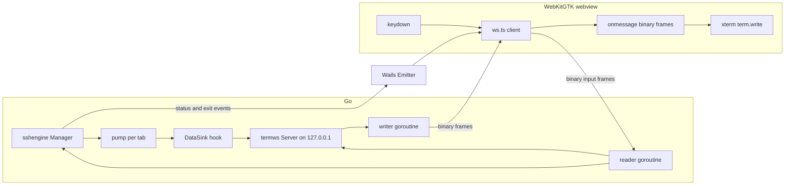

# Plan P005 — Terminal I/O over a local WebSocket transport

**Master plan:** [`plans/1787912690309-master-plan.md`](plans/1787912690309-master-plan.md) —
read **§2 (A5, A6, A7), §5 (event contract, threading, backpressure, engine must NOT import wailsvc),
§6 (Terminal, performance budgets), §8 (items 3 and 9 — memory hygiene / no network calls),
§11 (Wails isolation)** before starting.

**Status: implemented (commit pending).** Supersedes the tuning-only approach of
commit 267d927 for the extreme-flood case.

---

## 1. Problem (measured)

Two failures appear only under sustained terminal output far beyond the §6 budget
(10K RPS nginx log ≈ 3 MB/s vs the 100 KB/s budget):

| Symptom | Root cause |
|---|---|
| Ctrl+C to a busy `tail -f` reacts after tens of seconds | Every `terminal:data` event travels the Wails v3 Linux event bridge (mailbox goroutine → GTK main loop → `webkit_web_view_evaluate_javascript` → JS promise chain `__eq`). The promise chain **starves macrotasks**: keydown is a macrotask, the `__eq` microtask chain never drains, so the keystroke never runs. Additional per-event cost: base64 inflate, out-of-line payload fetch (>8 KB, `maxInlineEventPayload = 8192`), `atob` + `TextDecoder` + software-canvas render on the JS main thread. |
| `runtime/cgo: pthread_create failed: Resource temporarily unavailable` (SIGABRT) | The per-event bridge machinery spawns goroutines (mailbox drain, `eventPayloadStore.put` reap, HTTP fetch handlers, webkit evals) that under ~47 events/s exhaust process threads. |

Tuning levers inside the existing bridge (25 ms vs 50 ms tick, 16 KB vs 64 KB batches,
reader-side pause) reduce but cannot eliminate either failure: the costs are
per-event and throughput-bound.

## 2. Solution overview

Route terminal **bytes** (output and input) over a dedicated local WebSocket in
binary frames, bypassing the Wails event bridge entirely. Rare lifecycle events
(status, exit, hostkey prompts, forwards, toasts, monitor metrics) stay on the
existing event contract.

Why this fixes both failures at the root:

- **No microtask starvation.** Browser WebSocket `message` handlers are ordinary
  macrotasks that interleave fairly with keydown events; a keystroke runs even
  mid-flood.
- **No per-event goroutine/thread churn.** One connection, one reader and one
  writer goroutine; no mailbox, no payload store, no webkit eval per batch.
- **Real flow control becomes possible and safe.** When the browser socket buffer
  is full (renderer saturated), the Go writer blocks → the pump stalls → the
  reader pauses at a bounded cap → the SSH channel window throttles the remote.
  Input is full-duplex on the same socket: JS→Go frames are processed by an
  independent reader even while Go→JS writes are blocked, so Ctrl+C reaches the
  remote tty and kills the flood. This is exactly how native terminals behave.
- **Cheaper per byte.** Binary frames: no base64 (33% smaller), no `atob`, no
  `TextDecoder` (xterm accepts `Uint8Array` directly).

## 3. Architecture

### 3.1 Component layout



### 3.2 Framing (binary, length-prefixed)

Both directions share one frame format:

```
+--------+------------------+----------+-----------------+
| u8 len | tabID ASCII      | u32 size | payload bytes   |
+--------+------------------+----------+-----------------+
```

- `tabID` is the tab's ULID string; len capped at 64.
- `payload` is raw terminal bytes (output Go→JS, input JS→Go).
- Caps (defensive): payload ≤ 256 KB per frame; a bigger batch is split.
- No base64, no JSON on the data path. Status/exit/etc. remain JSON events on
  the existing contract.

### 3.3 Server (`internal/termws`, new package)

- Listener on `127.0.0.1:0` (ephemeral port), path `/terminal`.
- **Single active connection** (single-window app, master plan A7); a second
  upgrade is rejected.
- Origin check: reject upgrades whose `Origin` is not local (localhost/file).
- Writer goroutine: serializes frames from the pump sink; blocks when the
  browser socket buffer is full — this is the natural backpressure point.
- Reader goroutine: parses input frames, validates tabID, calls
  `Manager.Write`-equivalent (engine `Write(tabID, raw)` on the decoded bytes).
- `Close()` unblocks writers and drops the connection (app shutdown, vault
  lock).
- Reconnect: the frontend reconnects with backoff; while the socket is down the
  sink write blocks (flow control) so the tab simply pauses — no data loss, no
  spin.

### 3.4 Engine hook (`internal/sshengine`)

- Add a pluggable sink:

```go
// TerminalDataSink receives raw terminal output bytes instead of the
// terminal:data event. Set by the composition root when a dedicated
// transport is wired (plan P005); nil keeps the legacy event path.
type TerminalDataSink interface {
    OnTerminalData(tabID string, data []byte)
}
```

- `Manager.SetDataSink(sink)`: sets it once at startup.
- In the pump's `flush`: if the sink is set, `sink.OnTerminalData(tabID, data)`
  is called and **no** `EventTerminalData` is emitted; otherwise the legacy
  emitter path runs (unchanged behavior for headless tests).
- Restore the reader-side pause at a bounded cap (the `drained`-signal pattern
  tried earlier) — now safe, because the thread-churn source (the Wails event
  bridge) is gone from the data path. Cap ≈ 256 KB per tab.

### 3.5 Composition root (`internal/app/app.go`)

- Create `termws.Server` in `New()`, keep it on the `App` struct.
- `engine.SetDataSink(wsServer)` and `wsServer.SetInputHandler(engine.WriteRaw)`.
- `wsServer.Close()` in `Shutdown()` (before the engine shutdown).
- No `AppService` change needed (same-origin URL, §3.6).

### 3.6 Endpoint provisioning (same-origin)

- The `/terminal` handler is mounted on the app's OWN HTTP transport by wrapping
  the asset handler in `main.go` — the same origin that serves the frontend. The
  webview derives the URL from `window.location`
  (`ws(s)://<location.host>/terminal`): no port discovery, no separate listener,
  no mixed-content restriction. No `AppService` change is needed.

### 3.7 Frontend

- `frontend/src/terminal/ws.ts` (new): connect at boot (after
  `WindowRuntimeReady`), binary framing encode/decode, reconnect with backoff,
  `onOutput(tabID, bytes)` callback, `sendInput(tabID, bytes)`.
- `frontend/src/main.ts`: boot wires the WS client; `deliverTerminalData(tabID,
  bytes)` feeds `TermPool.write` directly. The existing `Events.On(TerminalData)`
  handler is kept as a fallback and is suppressed while the socket is connected
  (guarded, no double delivery).
- `frontend/src/terminal/xterm.ts`: `flushInput` sends via the WS when
  connected, otherwise falls back to `TerminalService.Write` (pre-connect).

### 3.8 What stays on Wails events

`terminal:status`, `terminal:exit`, `vault:hostkey-prompt`, `vault:key-prompt`,
`ssh:forward`, `sftp:progress`, `monitor:metrics`, `app:toast` — unchanged.

## 4. Security (master plan §8)

- Listener binds `127.0.0.1` only; §8.9 gains the documented exception
  "local terminal-I/O WebSocket on 127.0.0.1" (no external reachability).
- Origin validation rejects non-local upgrades.
- Single connection; frame caps (tabID ≤ 64, payload ≤ 256 KB); unknown tabID →
  frame dropped (never routed).
- No secrets over the socket: only terminal I/O; credentials still never cross
  IPC (§8.1). Key material is unaffected.
- No logging of payload bytes (§8.3).

## 5. Files

| File | Change |
|---|---|
| `go.mod`, `go.sum` | add pinned `github.com/coder/websocket` (pure Go, minimal) |
| `internal/termws/frame.go` | framing encode/decode, caps |
| `internal/termws/frame_test.go` | round-trip, caps, malformed input |
| `internal/termws/server.go` | listener, upgrade, origin check, single conn, writer/reader, Close |
| `internal/termws/server_test.go` | accept/reject, input/output round-trip, close semantics, payload split |
| `internal/sshengine/manager.go` | `TerminalDataSink`, `SetDataSink`, `WriteRaw` |
| `internal/sshengine/live.go` | flush routes via sink; reader-side pause at cap |
| `internal/sshengine/phase3d_test.go` | sink-routing test (sink set → no event; nil → event) |
| `internal/app/app.go` | create server, wire sink + input handler, close in Shutdown |
| `main.go` | wrap the asset handler: `/terminal` upgrades, everything else serves assets |
| `frontend/src/terminal/ws.ts` | WS client (new) |
| `frontend/src/main.ts` | WS boot, `deliverTerminalData`, fallback guard |
| `frontend/src/terminal/xterm.ts` | input via WS with Write fallback |
| `AGENTS.md` | transport note + §8.9 exception + contract table note |
| `plans/1788280000000-plan-p005-terminal-ws-transport.md` | this plan |

## 6. Decisions

| # | Decision |
|---|---|
| D1 | Terminal bytes go over the WS; lifecycle events stay on the Wails contract. |
| D2 | Binary length-prefixed framing, tabID + raw bytes; no base64 on the data path. |
| D3 | `/terminal` mounts on the app's existing HTTP transport (wrapped asset handler in `main.go`); the frontend derives the same-origin URL from `window.location`. |
| D4 | Sink hook in `sshengine` keeps the engine transport-agnostic; nil sink preserves the legacy event path (headless tests unchanged). |
| D5 | Reader-side pause restored with the WS transport (safe now that the bridge is bypassed); WS write blocking provides natural flow control. |
| D6 | Input travels the same socket JS→Go (independent reader goroutine) — Ctrl+C works even while Go→JS writes are blocked. |
| D7 | Fallback: input uses `TerminalService.Write` before the socket connects; output events are suppressed while the socket is active. |
| D8 | One active connection; origin-checked; localhost-only (§8.9 documented exception). |
| D9 | Dependency: `github.com/coder/websocket` pinned via `go mod tidy` in the dev container. |
| D10 | Cap 256 KB per frame; bigger pump batches are split by the adapter. |

## 7. Exit criteria

1. `make test` (with `-race`) and `make lint` green.
2. New unit tests: framing round-trip/malformed/caps; server accept/reject/origin;
   engine sink routing (sink set → emitter silent, sink gets bytes).
3. In-process integration (rig, no Docker): a tab's echo arrives over a real WS
   client connection; input sent over the WS reaches the pty and echoes back.
4. Manual QA on the user's 10K RPS repro: `tail -f` of the busy nginx log →
   Ctrl+C stops output within ~1 s; no `pthread_create` crash after minutes.
5. Typing latency regression: still fast (input path unchanged except the
   transport; WS send is a plain macrotask).
6. Vault lock / app exit closes the socket cleanly; reconnect after webview
   reload resumes output without duplicates.

## 8. Rollout order

1. `internal/termws` framing + tests.
2. `internal/termws` server + tests.
3. Engine sink hook + reader pause + tests.
4. Composition root + AppService endpoint.
5. Frontend WS client + xterm/main wiring + fallback.
6. Docs (AGENTS.md) + `make test` + `make lint` + manual QA at 10K RPS.

---

## 9. Addendum (implemented, 2026-09-01) — loopback listener instead of same-origin mount

**Status: implemented.** The as-built transport deviates from §3.6: the
`/terminal` upgrade is NOT served on the app's own HTTP transport, because
**the Linux webview loads from the `wails://` custom URI scheme, which cannot
carry WebSockets** (Wails' own `stream.go` documents exactly this; the
custom-scheme ResponseWriter has no Hijacker, and a browser cannot open a
socket to a custom scheme at all). Symptoms of shipping the §3.6 version:
session output blocked until `fallbackGrace` (slow 5–10 s session open), then
the legacy-event bridge flood returned (`pthread_create EAGAIN` crash).

### 9.1 What changed

- **Loopback listener** ([`internal/termws/server.go`](../internal/termws/server.go)):
  `Server.Start("127.0.0.1:0")` binds an ephemeral-port listener and serves
  `/terminal` upgrades on it. `Close()` also closes the listener.
- **Port provisioning**: `GET /termws-port` (same `ServeHTTP`, mounted on the
  `wails://` asset handler in [`main.go`](../main.go)) returns the bound
  address as plain text. The frontend fetches it and connects to
  `ws://127.0.0.1:<port>/terminal`. No service/bindings change needed — the
  Wails runtime already uses plain fetches to `wails://` URLs.
- **Origin check**: `wails://*` (webview page origin, host varies by build),
  `localhost:*`, `127.0.0.1:*`. A literal `Origin: null` (WebKitGTK's opaque
  serialization of the custom-scheme page) is stripped before Accept —
  coder/websocket cannot match it (`url.Parse("null")` has no host). Any
  `http(s)://` web origin (DNS rebinding / CSRF) is rejected. A random
  per-run port + Origin check keeps other local processes out.
- **`fallbackGrace` 15 s → 3 s** (var, test-overridable): a broken socket now
  degrades to legacy events quickly instead of stalling first output.
- **Read limit** `maxPayload+1024` on accepted connections (input frames are
  sender-capped).
- **Diagnostics**: `log.Printf` on listener bind, webview connect, first
  accept rejection, and fallback engagement — decisive for any future
  transport issue.
- **Frontend** ([`frontend/src/terminal/ws.ts`](../frontend/src/terminal/ws.ts)):
  async address resolution with 5 s fetch timeout + 1 s retry loop (never
  throws); input frames split to ≤256 KB before send.
- **Tests**: loopback bind + serve round-trip, idempotent second `Start`,
  `/termws-port` 503→200 + method check, `Close` stops the listener.

Security (§8.9 of the master plan) still holds: loopback-only bind, ephemeral
port provisioned only to the webview, Origin checked against the `wails://`
page origin, capped frames.