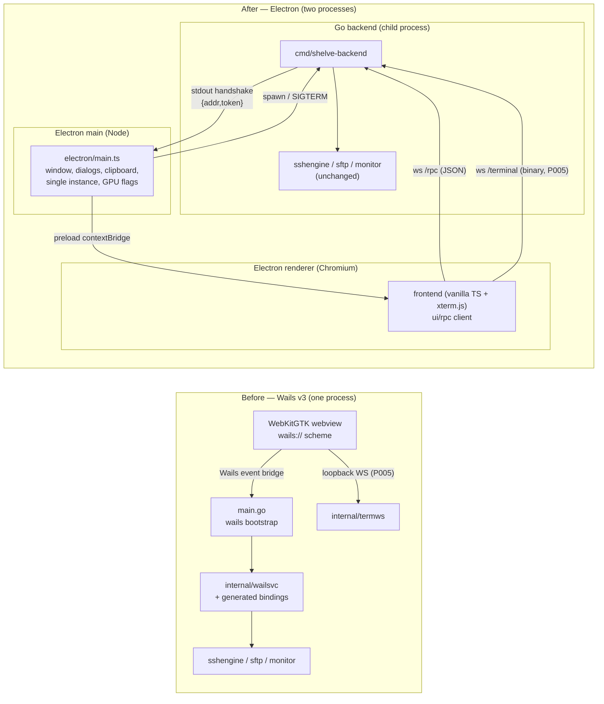

# Electron Migration — Roadmap

> **Status:** plan of record (2026-09-15). Supersedes the Wails v3 delivery
> architecture. Read [`1789467100000-master-plan.md`](1789467100000-master-plan.md)
> (the Electron master plan) before any phase file.
>
> **Owner decision:** full switch from Wails v3 to Electron. Linux only.

---

## 1. Why migrate

Wails v3 is a **beta** GUI toolkit built on **WebKitGTK 6.0** on Linux. Every
hard windowing/rendering problem in the Shelve history traces to that stack, not
to Shelve's code:

| Observed problem | Root cause |
|---|---|
| White/light flash on inactive windows with a terminal open | WebKitGTK accelerated-compositing clear-colour latch (`main.go` forces software dmabuf off to mask it). |
| Terminal canvas freezes when moving between mixed-DPI monitors; mixed-DPI maximize stalls under output floods | WebKitGTK multi-monitor surface reconfiguration + `matchMedia` resolution events are unreliable. Requires the `recoverRenderer`/`recoverAll` hacks poking `_renderService` private APIs in `frontend/src/terminal/xterm.ts`. |
| WebGL addon unusable on mixed-DPI X11; software rasterizer by default | Software WebKitGTK renderer. |
| Input starvation / `pthread_create EAGAIN` crash under terminal floods | Wails event bridge (promise-chain microtask starvation + per-event goroutine churn) — mitigated by the plan P005 loopback WebSocket, but the whole reason the workaround exists is the Wails bridge. |
| File inputs only expose a basename; key paths need a Wails-specific native dialog | WebKitGTK `File.path` removal. |
| Cross-distro packaging fragile (bundling WebKitGTK + helpers + GLib schemas) | `wails3 generate appimage` + linuxdeploy-plugin-gtk. |
| Beta API churn, no HiDPI zoom model | Wails v3 beta. |

Electron = Chromium. It is the stack **VSCode** ships: hardware-accelerated
compositing, a real per-display DPI model, a mature WebSocket/GPU pipeline, a
first-class native dialog/clipboard/IPC model, and a well-trodden Linux AppImage
path. Migrating buys correctness on HiDPI, GPU rendering, and packaging at the
cost of a process split (Go backend + Electron shell).

**Constraints that shape the migration (hard requirements):**

1. **No functional change.** Every existing feature must behave identically:
   vault lifecycle, tree/search/editor, terminal tabs, prompt modals, jump
   hosts/bastion, SFTP browser, monitor bar, credentials, saved jump hosts,
   12 themes, shortcuts (physical-key keyed), autolock, clipboard.
2. **HiDPI correctness** on 100 / 125 / 150 / 175 / 200 % displays, including
   windows moved between monitors with different scale factors.
3. **Performance parity or better.** Terminal at 100 KB/s sustained (and the
   3 MB/s flood repro) stays responsive; search < 10 ms over 300 nodes; tree
   rebuild < 50 ms.
4. **Render like VSCode.** Chromium GPU acceleration must be enabled by
   default, with the same escape hatches (`--disable-gpu`) and resilience
   (GPU-process crash handling).
5. **Linux only.** Two build outputs: local `make build && make run`, and
   `make appimage`. `make appimage-alt` and every related legacy file is
   deleted.

## 2. The key insight that makes this tractable

The Go backend is **already transport-agnostic**:

- `internal/app` must not import Wails (enforced today).
- **Only `main.go` and `internal/wailsvc/appservice.go` import the Wails API.**
  Every other `internal/wailsvc` service is a plain Go struct with JSON DTOs —
  it is already an RPC surface in disguise.
- Terminal bytes already ride a **loopback WebSocket** (`internal/termws`,
  plan P005), not the Wails bridge.

So the migration is **not** a rewrite. It is:

1. Replace the Wails bootstrap in `main.go` with a standalone Go backend that
   serves the existing services over a loopback WebSocket.
2. Replace `AppService.PickFile`'s Wails dialog with an Electron dialog.
3. Replace `@wailsio/runtime` + generated bindings in the frontend with a small
   TS RPC client whose service namespaces are drop-in replacements.
4. Add an Electron main/preload shell and a Linux packaging pipeline.
5. Delete every Wails-specific workaround and file.

**The entire Go domain layer — vault, model, store, sshx, sshengine, sftp,
monitor, termws, config — is preserved byte-for-byte.** No functionality can
change because the code that implements it does not change.

## 3. Before → after architecture



- **Main ↔ backend:** stdio only for lifecycle (spawn, handshake on stdout,
  shutdown). No application data crosses stdio.
- **Renderer ↔ backend:** one loopback WS listener with two endpoints — `/rpc`
  (JSON request/response + server→client events) and `/terminal` (binary
  terminal I/O, unchanged framing). Bearer token required on upgrade.
- **Main ↔ renderer:** a minimal `contextBridge` API (bridge endpoint + token,
  native dialogs, clipboard, window state, theme, app lifecycle). No Node in
  the renderer.

## 4. Transport contract (replaces the Wails IPC)

| Concern | Wails today | Electron target |
|---|---|---|
| Service calls | `@wailsio/runtime` generated bindings, async promises | `bridge.call("SessionService", "Tree", [])` over `/rpc`; generated TS proxy namespaces keep call sites unchanged |
| Server→client events | `Events.On("terminal:status", …)` | `bridge.on("terminal:status", …)` over `/rpc` (text JSON frames) |
| Terminal bytes | loopback WS `/terminal` (P005) | **unchanged** (`internal/termws` framing) |
| Event names / payloads | master plan §5 table | **byte-identical** (same Go payload structs) |
| DTOs | `internal/wailsvc/dto.go`, regenerated bindings | **same DTOs**, TS types mirrored in `frontend/src/rpc/types.ts` |
| Native file dialog | `AppService.PickFile()` via Wails `application.Dialog` | `window.shelve.pickFile()` via `ipcRenderer.invoke` → `dialog.showOpenDialog` (main) |
| System clipboard | `@wailsio/runtime` `Clipboard` | `window.shelve.clipboard.readText/writeText` via IPC to Electron `clipboard`; `navigator.clipboard` fallback |
| OS theme change | `Events.Types.Common.ThemeChanged` | `matchMedia('(prefers-color-scheme: dark)')` in the renderer + `nativeTheme` in main (already present in `ui/theme.ts`) |
| Window geometry | Wails `WebviewWindowOptions` | Electron `BrowserWindow` + persisted `window.*` settings (read by main at start, written by renderer via `SaveSettings`) |
| Vault state → UI | `vault:state-changed` event | **unchanged** event over `/rpc` |

**RPC envelope** (text WS frames):

```jsonc
// request
{"id": 7, "svc": "SessionService", "method": "Tree", "args": []}
// response (exactly one of)
{"id": 7, "result": {...}}
{"id": 7, "error": "store: not found"}
// server → client event
{"event": "terminal:status", "data": {"tabID":"01H…","state":"ready"}}
```

Errors are the Go error string; the TS client rejects with `new Error(msg)` so
the existing `String(err)` / `err.message` call sites keep working.

The backend dispatcher uses **reflection over the registered service structs**
(the same `(T, error)` / `(T)` / `(error)` shapes Wails bound), so no per-method
RPC code is written and the surface cannot drift from the service definitions.

## 5. Phase index (execute strictly in order)

The order is **backend-first**: E1 is the one deep engineering change and is
fully verifiable headlessly (Go tests + a real WS client), exactly like the old
Phase 2/3 backend gate. The Electron shell follows, then the frontend switch,
then rendering, packaging, cleanup and acceptance.

| Phase | Plan file | Focus | Depends on |
|---|---|---|---|
| E1 | `1789467200000-electron-e1-backend-bridge.md` | Standalone Go backend (`cmd/shelve-backend`) + `internal/bridge` (reflection RPC + event fan-out + token + stdout handshake); rename `internal/wailsvc` → `internal/api`; drop the Wails dependency | — |
| E2 | `1789467300000-electron-e2-electron-shell-build.md` | Electron shell scaffold (main/preload), new `Dockerfile.dev`, Makefile rebuild, Vite/tsconfig changes, `electron-builder --dir`; window opens with a placeholder page; remove the Wails build path | E1 |
| E3 | `1789467400000-electron-e3-frontend-transport-native.md` | `frontend/src/rpc` client + drop-in service proxies; rewire `main.ts`, `clipboard.ts`, `theme.ts`; Electron native dialogs/clipboard/window-state/single-instance; delete bindings | E2 |
| E4 | `1789467500000-electron-e4-hidpi-gpu-rendering.md` | Per-monitor DPI model, fractional scaling, zoom; GPU acceleration matching VSCode; remove all WebKit hacks; xterm DPR/WebGL handling | E3 |
| E5 | `1789467600000-electron-e5-linux-packaging.md` | `electron-builder` AppImage; `make build`/`make run`/`make appimage`; delete `appimage-alt` + related files; host runtime deps documented | E4 |
| E6 | `1789467700000-electron-e6-legacy-cleanup-docs.md` | Remove every Wails/WebKit/AppImage-alt file; delete/replace obsolete plans; update `AGENTS.md` + `README.md` | E5 |
| E7 | `1789467800000-electron-e7-acceptance-qa.md` | Full functional parity QA, HiDPI matrix, GPU matrix, perf budgets, AppImage acceptance | E6 |

Gate rule (unchanged from the old roadmap): a phase is done only when its exit
criteria **plus `make lint` plus `make test`** pass from a clean container
(`make test-integration` where stated), and it is committed.

## 6. Cross-cutting gates (apply to every phase)

1. **No functional drift.** A phase that changes a user-visible behavior,
   DTO field, event name, or event payload fails review. The `/commit` diff
   must show `internal/{vault,model,store,sshx,sshengine,sftp,monitor,config}`
   untouched except for the explicitly listed mechanical renames.
2. **`make test` (Go, `-race`) green after every phase.** The backend keeps its
   entire existing test suite; it must never be weakened to fit the transport.
3. **`make lint` green** (gofmt + `go vet` + frontend `tsc --noEmit`).
4. **No secrets over IPC** (master plan §8.1), including the new RPC transport.
5. **No new network surface**: the only listeners are loopback `127.0.0.1`
   (master plan §8.9), token-gated.

## 7. Top risks

| Risk | Mitigation |
|---|---|
| Electron/Chromium fractional scaling weak on X11 | Default `--ozone-platform-hint=auto` (Wayland fractional scaling); X11 fallback derives `--force-device-scale-factor` from GTK/Xft DPI; renderer handles `devicePixelRatio` changes. Detail in E4. |
| Electron GPU blacklist → software rendering on some drivers | Surface GPU status; `--ignore-gpu-blocklist` opt-in; keep xterm canvas/DOM renderer fallback. Detail in E4. |
| Chromium sandbox in AppImage (`chrome-sandbox` needs setuid) | AppImage runtime is not setuid; launch with `--no-sandbox` only where required, or use electron-builder's default; verify on ALT Linux. Detail in E5. |
| Reflection RPC mismatch vs Wails binding coercions | Golden test: call every service method through the bridge and assert the JSON shape matches the DTO; keep the dispatcher registry explicit. Detail in E2. |
| Backend child-process crash/orphan | Main watches `child.on('exit')`, kills the tree on quit; backend handles `SIGTERM` → `App.Shutdown()`. Detail in E2. |
| Electron download/build weight in Docker | Cache `ELECTRON_CACHE` + `~/.cache/electron-builder` in named volumes, like the Go/npm caches today. Detail in E2/E5. |
| Losing a feature while "cleaning up" | E6's deletion list is exhaustive and gated by E7's parity QA against the checklist. |

## 8. Definition of done

E7 passes: every checklist item in the old master plan §6/§12 works on Electron
under 100/125/150/200 % scaling, on both X11 and Wayland sessions, with GPU
acceleration on; terminal perf budgets hold; `make build && make run` and
`make appimage` both work; no Wails/WebKit/`appimage-alt` artifact remains in
the tree.
