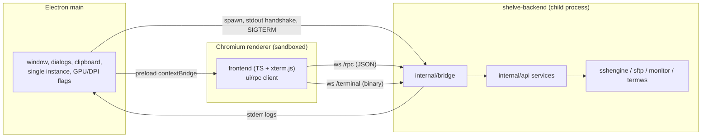

# Shelve — Master Plan (Electron)

> Single source of truth for architecture, data model, interfaces, security and
> build strategy. Every phase plan links back to the sections (§) that must be
> read before implementation. App UI language: English only.
>
> **Status: v2.0 (2026-09-15) — Electron architecture.** Supersedes the Wails v3
> master plan (`1787912690309-master-plan.md`, deleted in migration phase E6).
>
> **History**
> - v2.0 (2026-09-15): full switch from Wails v3 + WebKitGTK to Electron +
>   Chromium. Go backend becomes a child process driven over a token-gated
>   loopback RPC + terminal WebSocket. Linux-only delivery
>   (`make build && make run`, `make appimage`); the `appimage-alt` pipeline is
>   removed. All user-visible functionality is unchanged.
> - v1.1 (2026-08-29, historical): Wails v3; phases 3–5 decomposed; packaging
>   phase cancelled.
>
> **Migration docs:** [`1789467100000-electron-migration-roadmap.md`](1789467100000-electron-migration-roadmap.md)
> and phases E1–E7 (`1789467200000-electron-e1-backend-bridge.md` …
> `1789467800000-electron-e7-acceptance-qa.md`).

## §1 Goals & Non-Goals

**Goals**
- Lightweight, fast, fully local SSH session manager (no cloud, no telemetry, no
  accounts).
- **Go backend** (`golang.org/x/crypto/ssh`, `github.com/pkg/sftp`) as a child
  process + **Electron/Chromium** frontend (vanilla TypeScript + Vite +
  xterm.js). No framework, no Wails, no WebKitGTK.
- Encrypted vault (AES-256-GCM, key from Argon2id(master password)); zero
  plaintext credentials on disk and over IPC.
- Hierarchical tree (folders → subfolders → sessions) with live search,
  comfortable with 300+ sessions.
- Session card: Name, Host, Port, User, auth (password **or** SSH key path),
  structured Jump Hosts (incl. bastion mode), named credentials, "Extra Args"
  (strict validated subset).
- Terminal tabs above the terminal pane; session tree + search on the left;
  terminal in the center; optional SFTP browser in a right-hand panel;
  MobaXterm-style system-monitor bar under the terminal.
- Dark & light theme families with 18 variants (system-aware).
- **HiDPI correctness**: crisp at 100 / 125 / 150 / 175 / 200 %, including
  windows moved between monitors with different scale factors, on Wayland and
  X11.
- **VSCode-class rendering**: Chromium GPU acceleration on by default, same
  switches and graceful fallback as VSCode.
- **Performance parity**: terminal responsive at 100 KB/s sustained (and a
  3 MB/s flood), search < 10 ms over 300 nodes, tree rebuild < 50 ms.
- Developed and built entirely in Docker (host needs Docker only).
- **Linux-only delivery**: `make build` + `make run` (local) and
  `make appimage` (self-contained AppImage).

**Non-goals (v2)**
- Windows/macOS builds, signing, notarization (targets removed).
- DEB/RPM/Flatpak; `appimage-alt` (removed with the WebKit toolchain).
- Session sharing/sync, multi-window, recording/audit, auto-reconnect.
- Drag-and-drop in the session tree (context-menu "Move to…" instead).
- Drag-and-drop file uploads in SFTP (context menu / picker only).
- E2E UI test framework (manual QA checklists + `tsc` per phase).
- UI languages other than English.

## §2 Resolved Decisions

| # | Decision | Choice |
|---|----------|--------|
| D1 | GUI framework | **Electron** (Chromium), pinned to the same major as VSCode (42.x), Linux only. |
| D2 | Frontend | Vanilla TypeScript + Vite + xterm.js; no framework, no CSS framework. |
| D3 | Backend process model | Go backend as a **child process** spawned by Electron main; it prints `{addr,token}` on stdout and serves the UI over a loopback WebSocket. |
| D4 | UI↔backend transport | One loopback listener: `/rpc` (JSON request/response + server→client events) and `/terminal` (binary terminal I/O, plan P005 framing). Token-gated; no application data over stdio. |
| D5 | Vault unlock UX | Master password on every start; key in memory only; explicit Lock; opt-in auto-lock (default off). Never written to disk. |
| D6 | SFTP scope | Browse/upload/download/mkdir/rename/delete using the active session's connection, plus "edit text file with the system editor" (download → external editor → save-detection → re-upload). No file bytes over IPC — paths only. Cancel of `DownloadThenSave` keeps the temp file and returns its path with a toast; when the native multi-file dialog is unavailable `PickLocalFiles` returns the typed `ErrSftpDialogUnsupported` and the frontend shows a manual multi-path prompt instead. |
| D7 | Jump hosts / Extra Args | Structured ordered jump hosts (host, port, user, password or key path), each optionally flagged **Bastion**; Extra Args parsed by the strict `sshx/args` parser (`-L`, `-D`, curated `-o`, `ProxyJump=`). The dial chain is the structured jump hosts **in order**, then the parsed `ProxyJump`, then the target. |
| D8 | Named credentials / saved jump hosts | Reusable secrets live in the encrypted vault (`Credential`, `SavedJumpHost`); sessions may reference them (`CredentialID`, `JumpHostRef`); references are authoritative at connect time, inline fields remain the fallback snapshot. |
| D9 | GPU rendering | Hardware acceleration **on** by default, matching VSCode: no forced software path; the only off-switch is `--disable-gpu` / `--disable-hardware-acceleration` → `app.disableHardwareAcceleration()`. |
| D10 | HiDPI model | OS DPI from Chromium per-monitor scale; user zoom is a separate `1.2 ** level` applied via `webFrame`; display changes re-measure/refit, never reload the window. |
| D11 | Display backend | Wayland sessions default to the native Wayland (`ozone-platform-hint=auto`) for fractional scaling; X11 uses Chromium's global scale; both overridable. |
| D12 | Packaging | `electron-builder` AppImage (single Linux artifact) + the unpacked `electron-builder --linux dir` for local `make run`. |

**Additional architect decisions**
- A1 Host keys: app-managed OpenSSH `known_hosts` (TOFU; prompt to accept;
  mismatch = hard fail; never auto-accept).
- A2 SSH key-file passphrases are never stored; prompted once per connection,
  cached in process memory for the session.
- A3 Tabs are ephemeral: closing the app closes all sessions; no restoration.
- A4 No auto-reconnect; a disconnected tab shows an overlay with [Retry]/[Close].
- A5 Large file data never crosses IPC: uploads/downloads pass **paths**; Go
  streams the bytes.
- A6 Terminal output is batched in Go (≤ 50 ms or ≤ 64 KB) before delivery; 256 KB
  per-tab backpressure cap pauses the SSH reader.
- A7 One app window (single instance); geometry remembered in `settings.json`.
- A8 Destructive tree ops require a confirm dialog showing the affected count.
- A9 Search matches Name, Host, User (case-insensitive substring); folder path
  shown in results.
- A10 Session ID: ULID; explicit sibling order (array positions); move =
  re-index.
- A11 Single-window app means one active `/rpc` connection and one active
  `/terminal` connection; reconnects resume without data loss.

## §3 Technology Stack

| Layer | Choice | Notes |
|---|---|---|
| Language | Go ≥ 1.25; module `shelve` | backend child process |
| GUI | Electron (pinned, same major as VSCode `main`: **42.x**) | Chromium + bundled Node |
| Main/preload build | TypeScript bundled by **esbuild** → `dist-electron/*.cjs` | no bundler framework |
| Renderer build | TypeScript 5 + Vite (vanilla template), `base: "./"` | served from `frontend/dist` via `loadFile` |
| Terminal | `@xterm/xterm` + `addon-fit`, `addon-webgl` (fallback to canvas), `addon-web-links`, `addon-search` | WebGL preferred (Chromium GPU) |
| SSH | `golang.org/x/crypto/ssh` | dial/jump chain, PTY, `client.Listen` forwards |
| KDF/cipher | Argon2id (m=64 MiB, t=3, p=4, 16 B salt, 32 B key) + AES-256-GCM (random 12 B nonce, AAD `"dsmsv1"`) | unchanged |
| SFTP | `github.com/pkg/sftp` (pinned) | unchanged |
| IDs | `github.com/oklog/ulid/v2` | unchanged |
| RPC WS | `github.com/coder/websocket` (pinned, already present) | `/rpc` + `/terminal` |
| Packaging | `electron-builder` → AppImage (x86_64/aarch64) | Linux only |
| Build env | Docker `shelve-dev` (golang 1.25-trixie + Node + Electron/Chromium runtime libs + electron-builder) | host: Docker only |

## §4 Data Model & Storage

All data under `$XDG_CONFIG_HOME/shelve` (fallback `~/.config/shelve`), created
0700, files 0600. Never write outside this dir.

| File | Content | Encrypted? |
|---|---|---|
| `vault.json` | Envelope `{"v":1,"kdf":{"alg":"argon2id",…},"enc":{"alg":"aes-256-gcm",…}}` + ciphertext of `{"folders":[…],"sessions":[…],"credentials":[…],"savedJumpHosts":[…]}` (AAD `"dsmsv1"`) | YES |
| `settings.json` | No secrets (see schema) | no |
| `known_hosts` | OpenSSH subset (`[host]:port` supported; `ssh-ed25519`/`ssh-rsa`/`rsa` lines; comments/blanks skipped; hashed hosts, `@cert-authority`/`@revoked` markers, wildcard and multi-host hostspecs recognized-but-inert). `Save()` rewrites clean lines only, file 0600; `Fingerprint(key)` renders OpenSSH's `SHA256:<b64>` display form. | no |
| `tmp/` | SFTP edit/transfer temp files (0600, swept on lock/exit/start) | — |

**settings.json schema**
```jsonc
{
  "theme": "system | light | dark",
  "themeVariant": "",                  // e.g. "catppuccin-mocha"; "" = family default
  "autoLockMinutes": 0,                 // 0 = off
  "sftpBrowserEnabled": true,           // presence-aware: absent => true
  "monitoringEnabled": true,            // presence-aware: absent => true
  "sftpInitialPath": "~",               // global SFTP start path
  "textEditorCommand": "xdg-open",
  "terminal": { "fontFamily": "monospace", "fontSize": 13, "scrollback": 10000 },
  "window": { "width": 1280, "height": 800, "leftWidth": 320, "sftpWidth": 320 },
  "ui": { "zoomLevel": 0 }              // user zoom (E4 T7); 0 = none, clamped ±8,
                                        // separate from the OS device scale; no UI yet
}
```
- `leftWidth` clamp 240–480; `sftpWidth` clamp 200–640 with the terminal column
  ≥ 240 px; both persisted on drag (debounced 300 ms).
- `terminal.fontSize` clamp 8–24; `terminal.scrollback` clamp 500–100000.
- Window minimum 960×540 (Electron `minWidth`/`minHeight`); a persisted
  geometry is clamped up to it at startup.
- SFTP start-path precedence: per-session `SftpInitialPath` (when set) →
  `settings.sftpInitialPath` → `"~"`; the value must be absolute or
  `~`-prefixed.
- Presence-aware defaults (`sftpBrowserEnabled`, `monitoringEnabled`) mean an
  explicit `false` wins, a missing key means `true`.
- `settings.json` is audited to contain no secrets (unit test key allow-list).

**Model (Go, `internal/model`)**
```go
type Folder struct { ID, ParentID string; Name string; Children []string }

type AuthType int // AuthPassword | AuthKey
type Auth struct { Type AuthType; Password string; KeyPath string }

type JumpHost struct { Host string; Port int; User string; Auth Auth; Bastion bool }

type Session struct {
    ID, FolderID string
    Name, Host string; Port int; User string
    Auth Auth; JumpHosts []JumpHost; ExtraArgs string
    SftpInitialPath string
    CredentialID string   // named credential reference (plan P003)
    JumpHostRef  string   // saved-jump-host reference (plan P006)
}

type Credential struct { ID, Name, User string; Auth Auth }
type SavedJumpHost struct { ID, Name, Host string; Port int; User string; Auth Auth; Bastion bool }
```
- **Credential / saved-jump-host resolution:** while referenced, the saved
  entity is authoritative at connect/test time; inline `Auth`/`JumpHosts` stay as
  a self-contained snapshot that takes over when the reference is cleared
  (deletion soft-nulls it). `applyCredentialSnapshot` / `applyJumpHostSnapshot`
  keep the snapshot valid on save.
- **Bastion rules (plan P009):** at most one bastion hop and it must be last; its
  user must not contain `@`; with a bastion the target must be hostname/IPv4
  (no IPv6), port 22 only, Extra Args must not set `ProxyJump`, and the session
  `Auth` becomes optional (still a consistent XOR when set).
- **Validation:** Name non-empty; Host hostname/IPv4/IPv6 (bastion restricts);
  Port 1–65535; User non-empty; exactly one auth method (password XOR key);
  jump-host fields validated; Extra Args passes the parser; credential/jump-host
  references must exist when set. Duplicate names within a folder are allowed.
- **Password merge on update (Phase 4b):** the editor never receives stored
  passwords, so an empty incoming password on an existing password-auth session
  or jump host preserves the stored one (same rule for credential / saved
  jump-host `Update`); any non-empty value replaces it. The merged result still
  satisfies the auth XOR invariant.
- **Duplicate naming:** `DuplicateSession` copies into the same folder
  immediately after the original with the name suffixed `" (copy)"`.
- **Extra Args grammar (`internal/sshx/args`, strict):** whitespace-separated
  tokens; a single or double quote opens a quoted region closed only by the same
  quote (unbalanced quote = error); backslashes are literal and quoted
  whitespace does not join tokens. Accepted options:
  - `-L [bind:]localPort:dstHost:dstPort` — local port forward; an omitted bind
    normalizes to `127.0.0.1`.
  - `-D [bind:]localPort` — minimal SOCKS5 proxy, CONNECT verb only (no
    UDP/BIND/auth; documented limitation); omitted bind `127.0.0.1`.
  - `-o` for exactly `ServerAliveInterval`, `ServerAliveCountMax`,
    `ConnectTimeout` (non-negative integer) and `StrictHostKeyChecking=no|ask`
    (any other value or key = error); duplicate `-o` keys — last wins.
  - `ProxyJump=[user@]host[:port]` — at most one (omitted port = 22).
  Unknown flags and bare words are errors. IPv6 in any spec is rejected with a
  clear error (documented v1 limitation). For multiple jump hosts use the
  structured list instead of several `ProxyJump=` tokens.
- Key-file passphrases are not in the model (A2).
- Concurrency: single `Store` with `sync.RWMutex`; each mutation re-encrypts and
  atomically writes `vault.json` (tmp+rename), debounced 300 ms; flush on `Lock`
  and exit.

## §5 Architecture

### Process model



- Electron main spawns `shelve-backend`, reads a one-line JSON handshake
  `{"event":"ready","addr":"127.0.0.1:PORT","token":"…"}` from stdout (logs go to
  stderr), and provisions `{addr,token}` to the renderer through the preload
  bridge. On quit it sends `SIGTERM`; the backend runs `App.Shutdown()`.
- The backend's loopback listener is the only network surface besides the user's
  SSH hosts. `/rpc` is a JSON WebSocket (requests/responses + events); `/terminal`
  reuses the `internal/termws` binary framing. Both require the per-run token.
- The renderer is sandboxed (`contextIsolation: true`, `nodeIntegration: false`,
  `sandbox: true`) and reaches native capabilities only through the reviewed
  preload API (bridge endpoint, file dialog, clipboard, window state).

### Package layout
```
electron/
  main.ts               # window, spawn/supervise backend, native dialogs/clipboard,
                        # GPU/DPI flags, single instance, shutdown
  preload.ts            # contextBridge API (bridge endpoint, dialogs, clipboard, window state)
  placeholder.html       # E2 only, deleted in E3
cmd/
  shelve-backend/       # new Go entry point (handshake, signals, service registration)
  seed/                 # QA vault fixture generator (unchanged)
internal/
  app/                  # composition root (no GUI toolkit imports)
  api/                  # the service layer + DTOs (renamed from wailsvc)
  bridge/               # loopback RPC + event fan-out + token + stdin/stdout handshake
  config/ model/ store/ vault/ sshx/ sshengine/ sftp/ monitor/ termws/   # unchanged
frontend/
  index.html
  src/
    main.ts             # bootstrap, rpc event bus, mount gate
    store.ts            # pub/sub state
    rpc/                # client.ts, endpoint.ts, types.ts, index.ts (service proxies)
    components/         # tree, tabs, session-editor, settings-dialog, sftp-panel,
                        # monitor-bar, dialogs, unlock, toasts, confirm, prompts, shell, gear
    terminal/           # xterm.ts (TermPool), ws.ts
    ui/                 # theme.ts, themes.ts, dpi.ts, shortcuts.ts, keys.ts, dialog.ts,
                        # clipboard.ts, autolock.ts, b64.ts, dom
    style/              # base.css, themes.css, components.css
electron-builder.yml
Dockerfile.dev
Makefile
go.mod
```

### Service surface (`internal/api`, exposed 1:1 over `/rpc`)

RPC envelope:
```jsonc
{"id":1,"svc":"SessionService","method":"Tree","args":[]}   // request
{"id":1,"result":[…]}{"id":1,"error":"…"}                    // response
{"event":"terminal:status","data":{…}}                       // server→client
```
The dispatcher reflects over the registered service structs, so the surface is
exactly:

- **AppService**: `GetVersion`, `GetSettings`, `SaveSettings`.
- **VaultService**: `Status`, `CreateVault`, `Unlock`, `Lock`, `ApproveHostKey`,
  `RejectHostKey`, `SubmitKeyPassphrase`, `SubmitKbdintResponse`, `CancelKbdint`.
- **SessionService**: `Tree`, `Search`, `CreateFolder`, `RenameFolder`,
  `MoveNode`, `DeleteNode`, `CreateSession`, `Session`, `UpdateSession`,
  `DuplicateSession`, `ValidateExtraArgs`, `TestConnection`.
- **CredentialService**: `List`, `Create`, `Update`, `Delete`, `Get`, `Usage`.
- **JumpHostService**: `List`, `Create`, `Update`, `Delete`, `Get`, `Usage`.
- **TerminalService**: `Connect`, `Disconnect`, `Write`, `Resize`, `Reconnect`.
- **SftpService**: `IsActive`, `List`, `Mkdir`, `Rename`, `Remove`,
  `PickLocalFiles`, `Upload`, `Download`, `DownloadThenSave`, `EditRemoteText`,
  `CancelEdit`.
- **MonitorService**: `Start`, `Stop`.

**SFTP semantics (`SftpService`)**
- **Path resolution:** `""` and `"~"` → the tab's remote home (resolved once
  via `Getwd`); a leading `~/` expands the home prefix and a leading `~` is
  honored only at position 0; everything else passes through `path.Clean`.
  `..` traversal is allowed — the remote OS user's permissions govern.
- **`List`:** directories first, then case-insensitive name order; `.`/`..` are
  never present; each entry carries icon/name/size/modified.
- **`Remove`:** file or **empty** directory only; a non-empty directory →
  typed `ErrDirNotEmpty`.
- **Transfers:** one FIFO worker per tab, so at most one transfer is in flight
  and extras queue; on a file failure the remaining queue stops and the first
  error is toasted. Progress is throttled (≥ 256 KB or ≥ 250 ms) and emitted as
  `sftp:progress`.
- **Dialog fallbacks:** `PickLocalFiles` returns the typed
  `ErrSftpDialogUnsupported` when no native dialog exists → the frontend shows a
  manual multi-path prompt. `DownloadThenSave` cancel keeps the temp file
  (`tmp/`, 0600) and returns its path with an `app:toast`.
- **Edit as text:** one edit per tab (a second attempt → `ErrAlreadyEditing`);
  files > 2 MiB (`ErrTooLarge`) or with binary content are refused. The temp
  copy is `tmp/edit-<ULID>.<ext>` (0600). The stat watcher (1 s poll) is the
  only save trigger and fires when mtime **and** size are stable for 3 s; the
  save uploads to `remotePath + ".tmp.<ULID>"` then `Rename`s over the original
  (atomic), after which the watcher stops (one save only). `CancelEdit` SIGTERMs
  the process group (SIGKILL after 3 s), deletes the temp and log, and never
  uploads. Stale `tmp/edit-*` files are swept at startup.

DTOs live in `internal/api/dto.go`; read views never expose secrets (only
`AuthType`/`HasPassword`/`KeyPath`). Native file picking (`AppService.PickFile`
in v1) moves to the Electron main process; the frontend calls
`window.shelve.pickFile()`.

### Event contract (backend → renderer, over `/rpc`; names/payloads unchanged)
| Event | Payload | Producer |
|---|---|---|
| `vault:state-changed` | `{unlocked: bool}` | vault/app lifecycle |
| `vault:hostkey-prompt` | `{connID, host, port, keyType, keyB64, fingerprint}` | sshx host-key cb |
| `vault:key-prompt` | `{connID, keyPath}` | encrypted private key |
| `vault:kbdint-prompt` | `{connID, name?, instruction?, questions:[string], echo:[bool], prefill?}` | bastion hop |
| `terminal:status` | `{tabID, state:"connecting"\|"ready"\|"error"\|"closed", message?}` | sshengine |
| `terminal:data` | `{tabID, data b64}` | sshengine (fallback only; the WS is authoritative) |
| `terminal:exit` | `{tabID, exitStatus?}` | remote shell exit |
| `ssh:forward` | `{tabID, spec, state, localAddr?, error?}` | sshengine |
| `sftp:progress` | `{transferID, tabID, direction:"up"\|"down", doneBytes, totalBytes, fileName?, error?}` | sftp |
| `monitor:metrics` | `{tabID, hostname, cpuPercent, memUsedBytes, memTotalBytes, netUpBps, netDownBps, uptimeSeconds, diskUsedPct, diskRoot, dfText}` | monitor |
| `app:toast` | `{level, message}` | services |

### Terminal transport (plan P005, retained)
- Binary frames `[u8 tabIDLen][tabID][u32 payloadLen][payload]`, tabID ≤ 64 B,
  payload ≤ 256 KB (bigger batches split).
- Go batches output ≤ 50 ms / ≤ 64 KB with an interactive fast path; the reader
  pauses when a tab's pending buffer exceeds 256 KB (flow control).
- Input rides the same socket JS→Go (independent reader), so Ctrl+C works even
  while output writes are blocked.
- The `terminal:data` event remains as a pre-connect/never-connected fallback
  (3 s grace) for headless tests.

### Threading / failure modes
- One goroutine per SSH connection (read pump, forward accepts); store access
  via mutex; per-tab emitter buffers.
- `Lock()` disconnects all sessions, zeroizes the key, emits
  `vault:state-changed`.
- Disconnect while active → `error` state + message, tab kept (A4); Reconnect
  re-dials the full chain.
- Port-forward bind failure → non-fatal: `ssh:forward failed` + toast.
- Dial failures are attributed per hop: `jump host i/n (user@host:port): <err>`
  for a chain hop and `target host:port: <err>` for the final dial.
- Timeouts: `ConnectTimeout` from Extra Args, else 10 s per dial; interactive
  prompts (host key / key passphrase / kbdint) time out after 120 s. A bastion
  kbdint handshake aborts after 10 question rounds
  (`too many keyboard-interactive rounds`); `CancelKbdint` fails fast.
- Corrupt/undecryptable `vault.json` → refuse to unlock; never auto-overwrite.
- Backend crash → Electron main shows an error and quits (no orphan); GPU crash
  → Chromium restarts the GPU process; display change → debounced re-measure.

## §6 UI/UX Specification (English only)

### Layout
```
+------------------------------------------------------------------------------+
| tree (left)        |        terminal (center, resizable)      | SFTP (right)  |
| [Search sessions]  |  tab1  tab2  tab3                        | [x][<][~/p]  |
| [+Sess][+Folder] g |  xterm.js                                | [Up][New][R] |
| v Production       |                                          | +----------+ |
|   v Databases      |                                          | | d src/   | |
|     db-prod-01    ‣|                                          | | f app.go | |
| ...                |                                          | +----------+ |
|                    |  monitor bar (hostname CPU RAM ↑ ↓ up disk)| progress    |
+------------------------------------------------------------------------------+
```
- Body grid (5 columns): `left | split | terminal | sftp-split | sftp`; the two
  side panels span both rows, so the monitor bar sits under the terminal only.
- Left panel: 320 px default (drag 240–480, `window.leftWidth`); tree + search.
- Right SFTP panel: 320 px default (drag 200–640, `window.sftpWidth`; terminal
  keeps ≥ 240 px); shown when `sftpBrowserEnabled && sftpPanelOpen && active tab
  ready`; `×` closes, left-toolbar `[SFTP]` reopens; auto-opens on tab ready.
- Monitor bar: ~30 px, spans the terminal only.

### Components & behavior
- **Tree**: folders with chevron; selection; double-click session = connect; context
  menus (New Session/Folder, Connect, Edit, Duplicate, Move to…, Delete); F2
  rename, Delete delete (A8 count confirm); collapsed state not persisted. Empty
  tree shows the centered "No sessions yet — press [+ Session]" card.
- **Search**: live (~100 ms debounce); flat Results view `name host — path`,
  highlights, `No results for "<q>"`; Esc clears.
- **Tabs**: label = session name; status dot amber (connecting, pulsing) / green
  (ready) / red (error) / gray (closed); × on hover, middle-click closes; drag
  reorder; horizontal scroll; tab context menu.
- **Terminal**: xterm.js, fit addon, WebGL renderer with canvas fallback, 8 px
  padding; error/exit overlay card with [Retry]/[Close tab]; scrollback from
  settings. Keys: Ctrl+C always sends ETX; Shift+Backspace ^W; Ctrl+Shift+V
  pastes (bracketed-paste safe); Ctrl+Shift+C copies the terminal selection
  (no-op when empty); right-click pastes (intercepted in the capture
  phase so it never reaches a mouse-mode remote app as a button-2 event);
  drag-select copies on release; theme-aware cursor/selection.
- **Session editor** (modal): Name*, Host*, Port (22), User*, auth [Password |
  SSH key] (Browse…; key passphrase note), Saved credentials dropdown, Saved
  jump host dropdown, inline Jump Hosts repeater with **Bastion** checkbox,
  Extra Args (monospace + inline validation), SFTP start path, footer [Test
  connection]/[Cancel]/[Save].
- **Settings** (modal): General (theme mode, 18 variants, auto-lock, SFTP
  browser, System monitoring), Terminal (font family, size 8–24, scrollback
  500–100000), Files (text editor command).
- **Lock & auto-lock**: an explicit Lock confirms only when ≥ 1 tab is `ready`
  ("N active connection(s) will be closed. Lock the vault?") and skips the
  confirm otherwise. Auto-lock (active only when `autoLockMinutes > 0` and the
  vault is unlocked) polls every 60 s and locks **without** confirmation once
  idle for N minutes; activity is `pointerdown`/`keydown`, throttled to 5 s.
- **Unlock screen**: app icon, create/unlock modes, min length 8, strength hint,
  wrong-password error + shake.
- **SFTP panel**: header `×`, `←`, editable path bar, [Upload] [New folder]
  [Refresh]; rows (icon, name, size, modified); double-click dir navigates, file
  → Edit as text (≤ 2 MiB, binary guard); context menu Edit as text / Download… /
  Upload to here… / New folder… / Rename… / Delete…; footer transfer progress.
  Path bar: Enter navigates (empty → `"~"`; a `~`/`/`-prefixed value is used
  as-is; anything else is a child of the current path) and Esc or blur reverts;
  a failed `List` resets to the last good path. An empty folder shows
  "This folder is empty". The progress line reads
  `Uploading|Downloading <name> — <done>/<total> (<i>/<n>)`. Drag-and-drop
  uploads are out of scope (§1).
- **Monitor bar**: hostname, CPU + gauge, RAM used/total (MB/GB/TB), ↑/↓ speeds
  (sum of non-loopback interfaces), uptime `Xd Yh Zm`, disk % with an `df -h`
  hover tooltip; only the active ready tab; disabled via settings; 2 s cadence
  over a dedicated SSH connection (never contends with PTY). Linux targets only
  (non-Linux hosts show an empty/frozen bar); each exec has a 5 s timeout and
  the ticker stops itself after 5 consecutive failures; a snapshot older than
  10 s renders dimmed `—` placeholders.
- **Credential / saved-jump-host managers**: modals from the gear menu and the
  editor; secret-free lists; delete confirm with affected-session count.
- **Toasts** top-right (4 s / 6 s), **confirm dialog** (A8), **context menus**.
- **HiDPI/zoom model**: OS scale from Chromium per-monitor; renderer watches
  `matchMedia('(resolution: Ndppx)')` plus the main-process debounced display
  event and re-measures/refits; no reload. User zoom (optional) is separate.

### Shortcuts
| Keys | Action |
|---|---|
| Ctrl+K / Ctrl+L | focus search |
| Ctrl+T | connect selected / editor with empty draft |
| Ctrl+W | close active tab |
| Ctrl+Tab / Ctrl+Shift+Tab | cycle tabs |
| Ctrl+1…9 / Ctrl+Numpad1…9 | activate nth tab |
| Ctrl+, | settings |
| F2 / Delete | rename / delete selected node |
| Esc | close modal / clear search |
| Ctrl+C | interrupt (ETX), even with a selection |
| Shift+Backspace | delete previous word (^W) |
| Ctrl+Shift+V | paste clipboard into the active terminal |
| Ctrl+Shift+C | copy the terminal selection (no-op when empty) |
| Ctrl+Shift+E | toggle SFTP browser setting |

All shortcuts and terminal control keys are keyed to the **physical key
position** (`KeyboardEvent.code`, US layout) so they fire under any keyboard
layout; plain text input remains layout-aware. The physical code→byte map
matches a US layout, including the quirk combos (`Ctrl+3` → ESC, `Ctrl+8` →
`0x7F`, `Ctrl+Shift+2` → NUL, `Ctrl+Shift+/` → `0x1F`, letters `Ctrl+A…Z` →
`0x01…0x1A`). Plain Ctrl+V (no Shift) stays control byte `0x16` (readline
quoted-insert) and is never rebound to paste — only Ctrl+Shift+V pastes. While a
form field has focus, every shortcut except Esc is suppressed.

### Theming
- CSS custom properties under `:root[data-theme="light"|"dark"]` +
  `:root[data-variant="…"]`; tokens `--bg, --bg-panel, --bg-hover, --bg-active,
  --border, --text, --text-dim, --accent, --error, --ok, --warn, --terminal-bg,
  --terminal-fg`.
- 18 variants: Default Dark/Light, Catppuccin Mocha/Latte, Dracula, Nord (dark),
  Solarized Light, Nord Light, Gruvbox Dark/Light, One Dark, GitHub Light,
  VS Code Dark+/Light+, Solarized Dark, Tokyo Night, One Light, Quiet Light.
- Default follows the OS (`prefers-color-scheme`); manual override persisted;
  FOUC guard inline in `index.html`; terminal palette follows the variant.

### Performance budgets
- Search over 300 nodes < 10 ms; tree rebuild < 50 ms.
- Terminal 100 KB/s sustained responsive; 3 MB/s flood survives (macrotask WS
  delivery, ≤ 50 ms/≤ 64 KB batching, 256 KB backpressure, WebGL renderer).

## §7 Build & Development Environment

**Host needs Docker only.** All compilation is in the `shelve-dev` container
(golang 1.25-trixie + Node + npm + Electron/Chromium runtime libs +
`electron-builder`). `make run` executes on the host and needs the Electron
runtime libraries (listed in README).

| Target | Action |
|---|---|
| `make dev-image` | build `shelve-dev` |
| `make build` | Go backend + Vite renderer + esbuild main/preload + `electron-builder --linux dir` → `bin/linux-unpacked/shelve` |
| `make run` | run `bin/linux-unpacked/shelve` on the host |
| `make dev` | container hot-reload (Vite + Electron, X11); `build`+`run` is the always-supported loop |
| `make test` / `test-race` | Go tests in container (`-race`) |
| `make test-integration` | testcontainers sshd suite (Docker socket) |
| `make lint` | gofmt + `go vet` + renderer & electron `tsc --noEmit` |
| `make seed` / `unseed` | 300-session QA vault |
| `make smoke-vault` | headless vault smoke |
| `make appimage` | `electron-builder --linux AppImage` → `bin/shelve-<version>-x86_64.AppImage` |
| `make appimage-check` | extract + inspect + zero-dep smoke |
| `make clean` | remove build outputs |

- Version source of truth: root `package.json` `version` (keep
  `internal/app.Version` in sync).
- QA fixture: `cmd/seed` writes a disposable 300-session test vault (folders +
  sessions, credential and saved-jump-host fixtures, one bastion session) into
  the config dir, with a `--dir` override; `make unseed` removes `vault.json`
  and `known_hosts` but keeps `settings.json`.
- Electron caches (`ELECTRON_CACHE`, `ELECTRON_BUILDER_CACHE`) live in named
  volumes like the Go/npm caches.
- Removed: `wails3`, `wails-init`, `appimage-alt` (+ `Dockerfile.appimage-alt`),
  `deb`, `rpm`, `build-win`, `build-darwin`, `flatpak`.

## §8 Security Requirements (binding)

1. No plaintext credentials on disk: `vault.json` is the only secret store;
   `settings.json`/`known_hosts` are audited to contain none (unit test). **No
   plaintext credentials over IPC** (DTOs expose `HasPassword`/`AuthType` only) —
   with ONE scoped exception: the bastion hop's stored password may cross the
   transport inside `vault:kbdint-prompt.payload.prefill` only, to prefill masked
   keyboard-interactive inputs; never persisted/logged/cached. Keyboard-
   interactive answers typed by the user are never stored or cached.
2. Argon2id m=64 MiB, t=3, p=4; 16 B random salt; 32 B key; AES-256-GCM random
   12 B nonce per write; AAD `"dsmsv1"`.
3. Memory hygiene: master password/derived key zeroized; keys never logged;
   errors never include password/key material.
4. Config dir 0700, files 0600 (asserted by test).
5. Host keys: TOFU via app-managed `known_hosts`; mismatch = hard fail.
6. SSH key files: read-only; app never writes them.
7. Vault writes always atomic (tmp+rename), never truncated on failure.
8. SFTP temp files 0600 under `tmp/`, swept on lock/exit/start.
9. No network calls except to user SSH hosts and loopback listeners on
   `127.0.0.1`: the backend RPC/terminal WebSocket (ephemeral port, per-run
   token, provisioned only to the renderer) and local port-forward sockets. No
   telemetry/updates/crash reporting. No Ozone/GPU flags create network surface.
10. Corrupt/undecryptable vault → refuse to unlock, never auto-overwrite.
11. Renderer hardening: `contextIsolation: true`, `nodeIntegration: false`,
    `sandbox: true`, a minimal reviewed preload API, and a CSP; the renderer
    never gets Node access. AppImage sandbox fallback (`--no-sandbox` +
    `disable-gpu-sandbox`) is documented and changes none of the above.
12. The backend child process is spawned by main with an inherited `XDG_CONFIG_HOME`;
    it binds `127.0.0.1` only and exits on `SIGTERM`.

## §9 Testing Strategy

- **Go unit** (`make test`, `-race`): vault round-trip/wrong-password/tamper/
  lock; args parser matrix; known_hosts; store CRUD/move/delete/order; model
  validation incl. bastion and reference rules; settings load/save/defaults;
  perms + no-secret-leak; **bridge RPC** (dispatch shapes, unknown method, panic
  recovery, token gate, event fan-out, surface golden list); termws framing.
- **Go integration** (`make test-integration`, tag `integration`): testcontainers
  sshd — password/key auth, PTY echo, jump chains, forwards, host-key mismatch,
  disconnect events, SFTP ops + edit, monitor metrics, 300-session perf smoke.
- **Frontend**: `tsc --noEmit` in `make lint`; manual QA checklists per phase
  (no e2e framework).
- **Electron manual matrix** (E4/E7): scale factors 100–200 %, X11 + Wayland,
  monitor moves, GPU on/off, AppImage launch.
- **Perf smoke**: 300-session vault search timing; 100 KB/s and 3 MB/s terminal
  feeds with responsiveness notes.

## §10 Roadmap — Phase Index (execute strictly in order)

| Phase | Plan file | Focus |
|---|---|---|
| E1 | `1789467200000-electron-e1-backend-bridge.md` | Standalone Go backend + `internal/bridge` RPC/events/token; `wailsvc`→`api`; drop Wails |
| E2 | `1789467300000-electron-e2-electron-shell-build.md` | Electron shell + root `package.json` + Docker/Make build system |
| E3 | `1789467400000-electron-e3-frontend-transport-native.md` | `frontend/src/rpc` + native dialogs/clipboard/window state; app functional |
| E4 | `1789467500000-electron-e4-hidpi-gpu-rendering.md` | HiDPI/multi-monitor, GPU parity, remove WebKit hacks, perf |
| E5 | `1789467600000-electron-e5-linux-packaging.md` | `electron-builder` AppImage; delete `appimage-alt` |
| E6 | `1789467700000-electron-e6-legacy-cleanup-docs.md` | Remove legacy files + obsolete plans; AGENTS.md + README |
| E7 | `1789467800000-electron-e7-acceptance-qa.md` | Functional parity + HiDPI/GPU/perf/packaging acceptance |

Gate rule: a phase is done only when its exit criteria plus `make lint` and
`make test` pass from a clean container (`make test-integration` where stated),
and it is committed. The roadmap is the index; the E-files are the per-phase task
lists.

The 28 Wails-era plans in `plans/` were deleted in E6 **after** their durable
rules were captured here: they were per-feature/implementation task lists for a
substrate (Wails v3 + WebKitGTK) that no longer exists, so keeping them would
document a dead architecture and duplicate this plan. The master plan +
E-roadmap (plus the E7 acceptance checklist) are now the whole plan set; new
work extends them instead of adding another plan file.

## §11 Risks & Mitigations

| Risk | Mitigation |
|---|---|
| Chromium fractional scaling on X11 | Wayland sessions default to the native backend; X11 uses Chromium's global scale with a documented limitation and `--force-device-scale-factor` override (E4). |
| GPU blacklist → software rendering | Surface GPU status (`--gpu-info`); keep canvas/DOM fallback; never force software (VSCode parity); `--disable-gpu` remains the only off-switch. |
| AppImage `chrome-sandbox` (setuid stripped by FUSE) | Keep the renderer sandbox where possible; fall back to `--no-sandbox`/`disable-gpu-sandbox` when user namespaces are unavailable; `SHELVE_SANDBOX` override (E5). |
| Backend child-process crash/orphan | main watches `child.on('exit')`, bounded SIGTERM→SIGKILL on quit, backend handles SIGTERM; E2/E7 verify no orphan. |
| Reflection RPC drift | Surface golden test enumerating every service method (E1); DTO/event field names asserted by tests. |
| Electron download/build weight in Docker | Named cache volumes for `ELECTRON_CACHE`/`ELECTRON_BUILDER_CACHE` (E2/E5). |
| Losing a feature during cleanup | E6 ports every durable rule into this master plan before deleting a plan; E7's parity checklist gates acceptance. |
| Migration changes behavior by accident | The domain layer (`vault/model/store/sshx/sshengine/sftp/monitor/config`) is untouched; E7 verifies the diff is only the mechanical rename. |
| Electron beta/beta API churn | Pin Electron exactly (same major as VSCode); isolate main/preload to the small stable API surface. |

## §12 Global Acceptance Criteria (definition of done)

1. `make build` produces a runnable app (`bin/linux-unpacked/shelve`); `make run`
   opens the window on a stock recent Linux desktop (X11 and Wayland); window
   opens < 2 s.
2. Crisp, correct rendering at 100 / 125 / 150 / 175 / 200 % including per-monitor
   moves; GPU acceleration on by default.
3. 300-session vault: unlock < 1 s after KDF; search < 10 ms; tree ops < 50 ms;
   terminal responsive at 100 KB/s and a 3 MB/s flood.
4. All §8 security invariants hold (`-race` clean, secret-leak tests green).
5. End-to-end: create folder → create session (password/key/jump/bastion) →
   connect → terminal works → SFTP browse/upload/download/edit → monitor bar →
   credentials/saved jump hosts → lock → app unusable without the password.
6. `make build`, `make test`, `make test-race`, `make test-integration`,
   `make lint`, `make appimage` pass from a clean container with no host-side
   toolchain; the AppImage runs on a host with zero GTK/WebKit dependencies.
7. No Wails/WebKit/`appimage-alt`/non-Linux artifact or reference remains in the
   tree (git history excepted); README and AGENTS.md describe only the Electron
   architecture.
